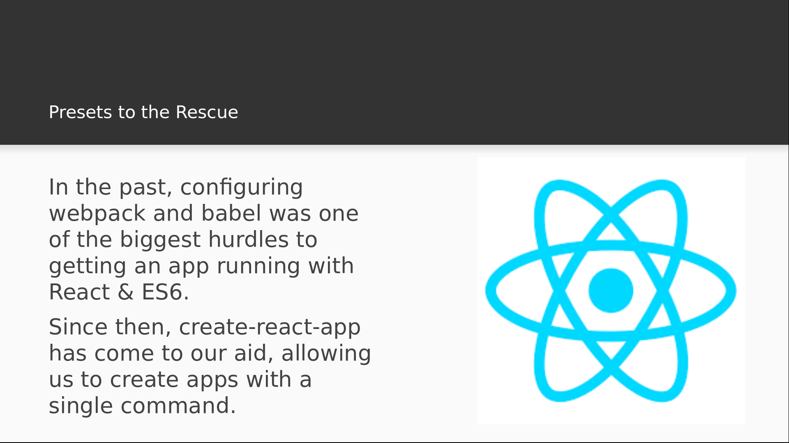

# Video 1.2

## Opening Slides


Hello and welcome to _Getting Started With React_


In this section, we'll see how to easily generate fully functional React apps with a single command. We'll then cover the basics of React's component rendering system, have a look at CSS-in-JS using the styled-components library, and then see how to handle errors gracefully using error boundaries.


Our first video will cover creating a new React application at the push of a button.



Webpack and babel are essential for building apps with JSX and ES6, and in the past,
developers would have to configure these manually, which can present a major learning
curve of its own. We now have tools like create-react-app and next.js that will build
React apps for us in a single command so that we can focus immediately on writing code.

So without further delay, let's create some React applications using each of these tools.

## Create-React-App

We'll start with create-react-app to build a standalone client. This is one that we'll
need to install locally.


```
$ npm install -g create-react-app

```

Now that that's installed we can create a new application using the `create-react-app` command.

```
$ create-react-app my-first-react-client
```

This command just created my app, and now at the bottom we see a list of scripts we can run
once we change into the application directory. Let's drop in and start up the React client.

```
$ cd my-first-react-client/
$ yarn start
```

_Browser Pops Up_

Success! We now have a functioning React application, and that couldn't have been easier. Let's
take a look inside the code.


Our javascript app starts in the `index.js` file in the `src/` directory. We can ignore the service
worker, or even just delete it.

_Delete service worker stuff_

It won't be needed for our purposes. The important point here is that we're using ReactDOM to bind
our react application to an element in an html document. That's how it all starts: the `App` component
contains a hierarchy of React components that creates a virtual DOM, and then that virtual DOM is rendered
to real HTML using the ReactDOM library. Now let's take a look inside the `App` component itself.

_Open App.js_

All this does is render some native html nodes. What we see here is what we saw on the browser a moment ago.
Notice the message inside the paragraph tag: it suggests that we edit the code and save to reload. So let's try
just adding some more markup to this component.

```javascript
<p className="App-intro">
  To get started, edit <code>src/App.js</code> and save to reload.
</p>
<h2>Hot reloading is the cat's pajamas!</h2>
```

Now let's head back to the browser.

_Back to browser_

Notice that we didn't have to reload to see our changes. `create-react-app` comes with hot reloading built in,
so when you're developing, changes on the code will reflect instantly on the page. This is a helpful feature
that can be difficult to setup manually, and one of many great reasons to use `create-react-app`.

## Conclusion

Today we learned how to use create-react-app to generate React applications with a single command,
without having to configure babel and webpack.


Join us for our next video where we'll go over the basics of the React component system.
