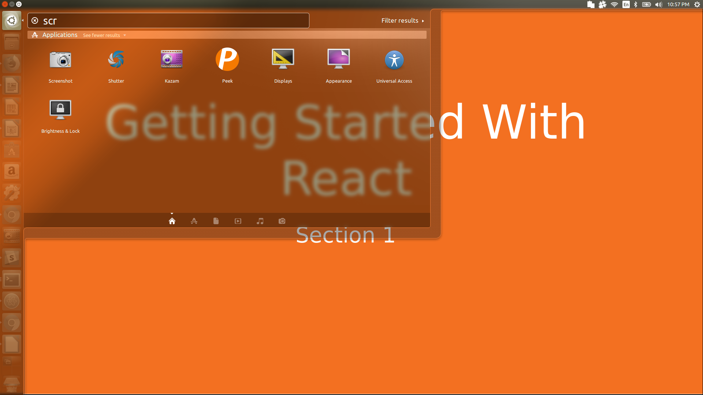
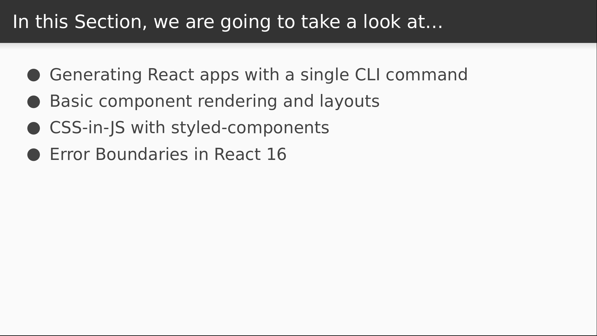
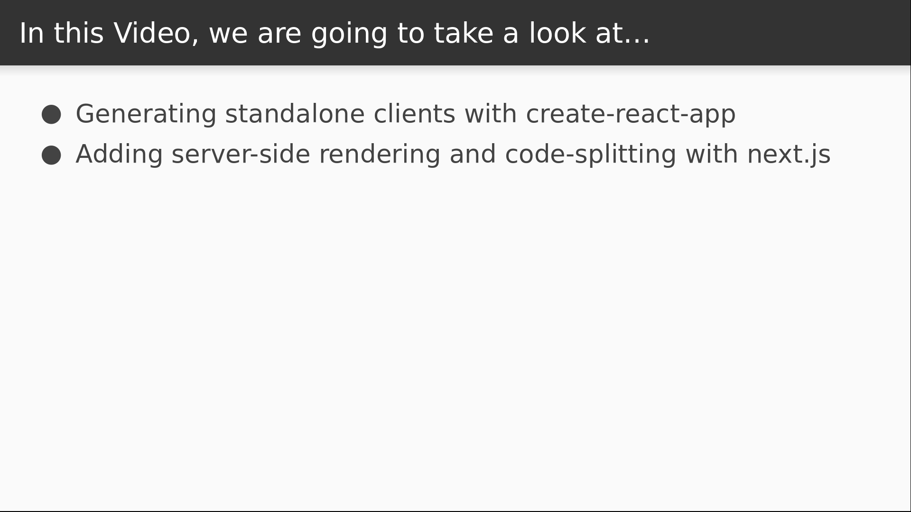
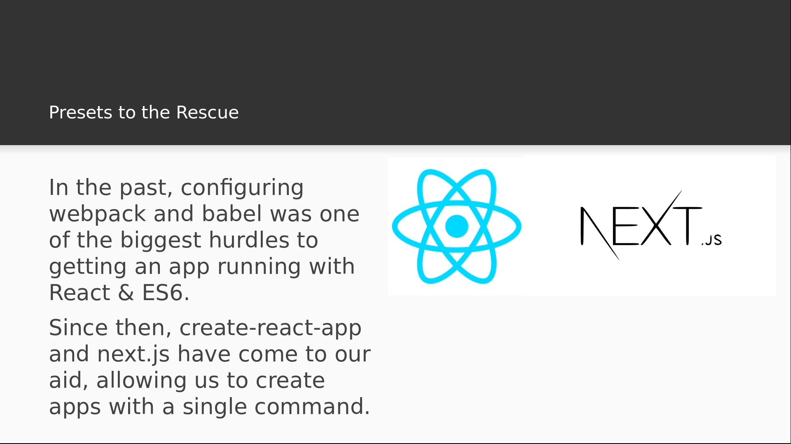
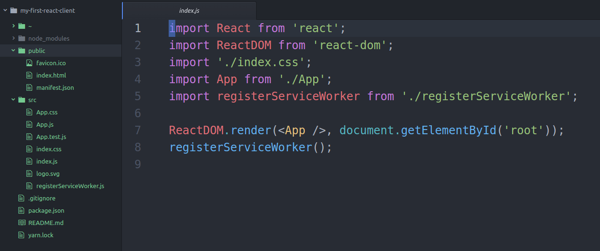
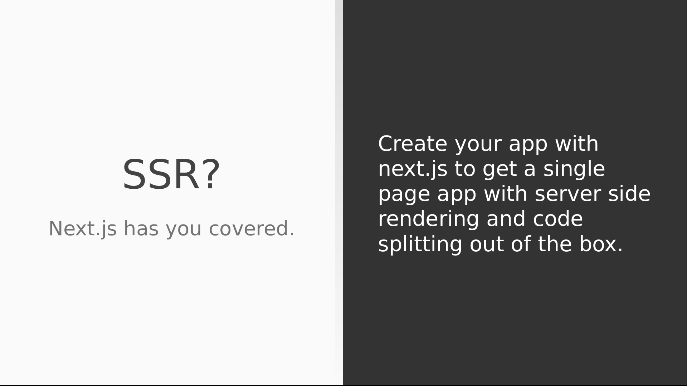
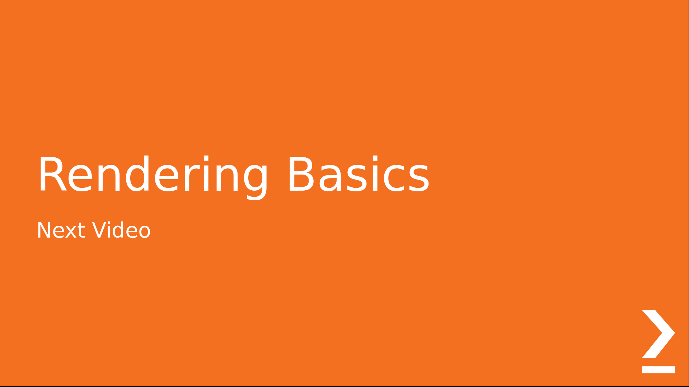

# Video 1.2

## Opening Slides



Hello and welcome...


In this section, we'll see...


Our first video will cover creating a new React application.


We'll see how to create simple standlone clients with create-react-app, and then use next.js to generate
an app with server side rendering and code-splitting out of the box.



Webpack and babel are essential for building apps with JSX and ES6, and in the past,
developers would have to configure these manually, which can present a major learning
curve of its own. We now have tools like create-react-app and next.js that will build
React apps for us in a single command so that we can focus immediately on writing code.

So without further delay, let's create some React applications using each of these tools.

## Create-React-App

We'll start with create-react-app to build a standalone client. This is one that we'll
need to install locally.


```
$ npm install -g create-react-app

```

Now that that's installed we can create a new application using the `create-react-app` command.

```
$ create-react-app my-first-react-client
```

This command just created my app, and now at the bottom we see a list of scripts we can run
once we change into the application directory. Let's drop in and start up the React client.

```
$ cd my-first-react-client/
$ yarn start
```

_Browser Pops Up_

Success! We now have a functioning React application, and that couldn't have been easier. Let's
take a look inside the code.



Our javascript app starts in the `index.js` file in the `src/` directory. We can ignore the service
worker, or even just delete it.

_Delete service worker stuff_

It won't be needed for our purposes. The important point here is that we're using ReactDOM to bind
our react application to an element in an html document. That's how it all starts: the `App` component
contains a hierarchy of React components that creates a virtual DOM, and then that virtual DOM is rendered
to real HTML using the ReactDOM library. Now let's take a look inside the `App` component itself.

_Open App.js_

All this does is render some native html nodes. What we see here is what we saw on the browser a moment ago.
Notice the message inside the paragraph tag: it suggests that we edit the code and save to reload. So let's try
just adding some more markup to this component.

```javascript
<p className="App-intro">
  To get started, edit <code>src/App.js</code> and save to reload.
</p>
<h2>Hot reloading is the cat's pajamas!</h2>
```

Now let's head back to the browser.

_Back to browser_

Notice that we didn't have to reload to see our changes. `create-react-app` comes with hot reloading built in,
so when you're developing, changes on the code will reflect instantly on the page. This is an excellent feature
that can be difficult to setup manually, and one of many great reasons to use `create-react-app`. But there are
other tools out there that can provide us with some additional benefits.

## Next.js



In particular, server side rendering is something that you might want to improve performance as well as search engine
optimization. If we use next.js to create our app, we'll get this for free along with other advanced features like code
splitting. Let's make an app right now and see just how easy it is. To begin with, we'll create a folder for the app
to live in.

```
$ mkdir my-first-next-app
$ cd my-first-next-app/
```

Now I'll initialize the project with yarn and add react, react-dom, and the next library.

```
$ yarn init
$ yarn add react react-dom next
```

The next step is to add some scripts to our package.json:

```
  "scripts": {
    "dev": "next",
    "build": "next build",
    "start": "next start"
  },
```

Now that our dependencies and scripts our setup, we can create a page. Next follows a really simple convention
for this: when we go to a URL in our application, next will look for a matching filename in a folder called 
`pages/`. So all we have to do is put a file there that exports a component. So let's just make a simple hello world
page.

_create folder & file in editor_

```javascript
export default () => <h1>Hello World!</h1>
```

This will just render a heading with the text, "Hello World!" Normally I'd also import the React library, but when
you define a page in Next, that import isn't needed. We should now have a working next app, so let's start our development
server and see what happens.

$ yarn run dev

This starts a development server, so let's open our browser and navigate to localhost:3000/hello-world

_open page in browser_

And there's our message. It's also worth noting that next comes with hot reloading built in, just like
create-react-app does. Let's modify our file and we should see the change reflect on the screen.

```javascript
export default () => (
  <div>
    <h1>Hello World!</h1>
    <h2>Reloading is so hot right now!</h2>
  </div>
);
```

So we'll just add a subheading and go back to the browser to have a look.

_return to browser_

And there we have it. Hot reloading for free.

## Conclusion

Today we learned a couple different ways that we can generate React applications with a single command,
without having to configure babel and webpack. We used create-react-app for a simple, standalone React
client, and then created a server-side-rendered React app using next.js.



Join us for our next video where we'll go over the basics of the React component system.
