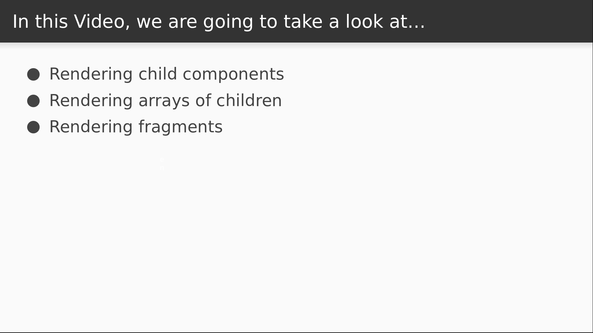

# Video 1.3

## Opening Slides


Hello and welcome Rendering Basics. In our last video we used create-react-app to build our first React application in a single command. Today we'll review the basics of rendering content from a React component.



In particular, we'll gain an understanding of the parent-child relationship that forms the component hierarchy that eventually translates to React's virtual DOM. We'll then see how to render arrays of children as well as fragments, both of which are new in version 16.

## Content

_open App.js_

To create a React component, we can define a class that inherits from React's `Component` class. Which is what we see here. So far, our App component is made up of native DOM elements. You can think of these as the primitives of JSX. A React component can render these primitives, or it can render other components. The native nodes are really components too, but we'll get to that later. For now let's pull some of these nodes out into another component. I'll start by creating a new file called `Home.js`.

_create file_

Now this time instead of inheriting from React's component class, I'm going to just define a function that returns JSX.

```javascript
import React from "react";

export default function Home() {
  return (
  );
}
```

This is another way to define a React component, and it's known as a pure function, which we'll talk more about throughout the course. For now we'll just grab the markup and the logo from the other component and place it in here.

_copypasta_

Now let's go back to our App component and render this as a child.

```javascript
import React, { Component } from "react";
import Home from "./Home";
import "./App.css";

class App extends Component {
  render() {
    return <Home />;
  }
}

export default App;
```

So now we've seen that components can render other components, or they can render native DOM nodes. But in fact, the native DOM nodes are really React components, too. What we actually have in a React application is a hierarchy of React components, where we use the primitives to control what actually gets displayed. React uses this tree to form a virtual DOM, which is a JavaScript representation of the real DOM. To see what happens from there, let's go back to our `index.js` file that contains the startup code for our React application.

_open index.js_

This single line of code uses `ReactDOM` to render our component hierarchy. This utility will take a React component as its first argument. It then translates the virtual DOM into real HTML and appends it to the element specified by the second argument.

Rendering components in React has worked in this way for a long time now, but since React 16 came along, there are a couple of new things we can do, so let's examine those quickly before we close.

_back to App.js_

Historically, React always required you return a single node from a component. If you wanted to render multiple sibling elements, you'd have to wrap them inside a parent. To demonstrate, let's see what happens if I try to add a sibling to the Home component.

```javascript
class App extends Component {
  render() {
    return <Home /><h1>Is where the heart is?</h1>;
  }
}
```

Now that I've tried to save this, my editor warns me of a syntax error, saying I need an enclosing parent tag. So I can fix this by wrapping it in a div.

```javascript
    return <div><Home /><h1>Is where the heart is?</h1></div>;
```

This makes the error go away, but since React 16 came out, we actually have alternatives. The first is to return an array.

```javascript
    return [<Home />, <h1>Is where the heart is?</h1>];
```

So now I have each node as an item in the array, and it compiles just fine. But there's still one small issue, which we'll have to visit our browser to see.

_open browser & dev tools_

Here in the console there's a warning saying that the components in our array need a `key` prop. This is something most React developers are familiar with.

_back to App.js_

It usually comes up when we're iterating over a collection and rendering some markup for each one. In that case, each item usually has an identifier that we can use as a unique key. We don't have that here, so we can just make some keys up.

```javascript
    return [<Home key="home" />, <h1 key="heading">Is where the heart is?</h1>];
```

This works fine, but it's a little bit unnatural and we're forced to come up with these unique key names ourselves. Fortunately, there's an even better way now to solve this problem, and it's called fragments.

```javascript
import React, { Component, Fragment } from "react";
import Home from "./Home";
import "./App.css";

class App extends Component {
  render() {
    return <Fragment><Home /><h1>Is where the heart is?</h1></Fragment>;
  }
}

export default App;
```

To use them, we import a Fragment component from react and we wrap our content inside it. There's also a shorthand syntax for it, but it's still not supported by most tooling, so it's still best to use it this way.

Today we learned the basics of React's component system. We saw how to use component classes, pure functions, and native nodes, we learned a bit about the virtual DOM, and we covered the different ways to render multiple children in a component.


Join us for our next video where we'll use styled-components to build a reusable layout for our app.

