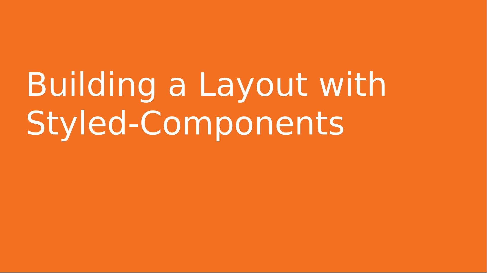
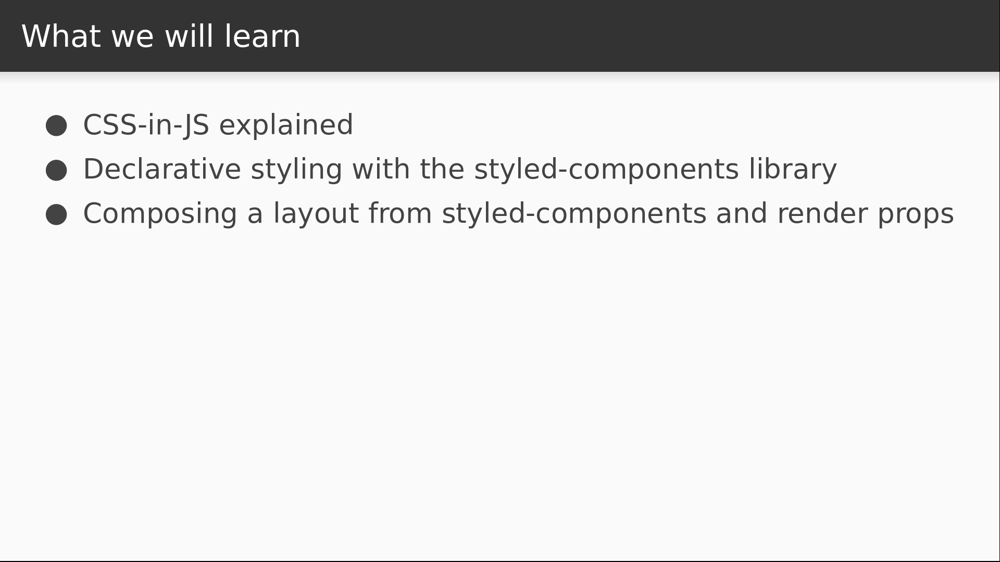
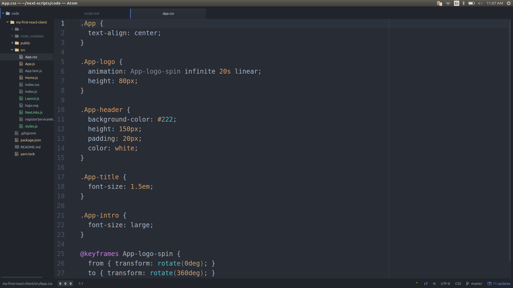

# Video 1.4

## Opening Slides



Hello and welcome to _Building a Layout with Styled-Components_. In our last video we covered the basics of React's component rendering system. Today we'll use the `styled-components` library to assemble presentational components into a reusable layout for the pages of our website.



We'll start by talking briefly about some of the problems that `styled-components` and other CSS-in-JS techniques are trying to solve. We'll then use the library to create a set of presentational components that will be used to create a reusable layout.

## Content

_open App.css_



Let's start by looking at the stylesheet that came bundled with `create-react-app`. Here we see different classes with different style declarations, and it might be fairly evident that each one is supposed to apply to a different markup structure. But it's not really clear what those structures would be, and there's nothing stopping me from applying as many of these classes as I want to a single element, even if they're not intended to be used together. As the UI and the stylesheet continue to grow throughout the life of an application, this problem only compounds and it becomes very easy to make mistakes. Let's see a simple demonstration.

_Open App.js_

First let's undo our fragment experiment from the last video and restore our display to its original state.

```javascript
import React, { Component } from "react";
import Home from "./Home";
import "./App.css";

class App extends Component {
  render() {
    return <Home />;
  }
}

export default App;
```

_Open Home.js_

Now let's just see what happens if I apply a couple extra classes to the `App-intro` paragraph.

```javascript
      <p className="App-intro App-logo App-header">
        To get started, edit <code>src/App.js</code> and save to reload.
      </p>
```

_Go to browser_

This is quite obviously not what we wanted. And while this example is a bit contrived, it should illustrate how easy the mistake is to make. I could also easily misspell the classname I'm supposed to be using. Plenty of things can go wrong. For this reason, lots of people prefer a more declarative approach. The simplest way to accomplish this is with an inline style. In React you can do this with a JavaScript object. For example, I can declare a `paragraphStyles` object that contains css properties.

```javascript
const paragraphStyles = { backgroundColor: "orange" };
```

Here we use the same property names that you'd see in a stylesheet, but camel cased instead of dasherized. I can now apply this to our `App-intro` paragraph to add the styles.

```javascript
      <p className="App-intro" style={paragraphStyles}>
```

_Check browser_

Here we can see that the style was applied. But there's a lot left to be desired when using inline styles, and several solutions have come along that combine the power and expressiveness of css with the more declarative nature of inline styles. One very popular library that does this is called `styled-components`. Let's install it now and see how it works.

```
$ yarn add styled-components
```

Now let's copy all the styles from `App.css` and copy them into a new file called `styles.js`.

_open styles.js, paste classes_

We're going to convert each style declaration into its own component, and this is going to be easier than you think. We'll bring in the library and start with the `App` class.

```javascript
import styled from "styled-components";
```

Since this class is applied to a `div` element, we'll define an `App` component using the `styled.div` function, but instead of parentheses, we use backticks which allows us to pass in a CSS string.

```javascript
export const App = styled.div`
  text-align: center;
`;
```

This is a big part of what makes `styled-components` so powerful. We can actually use real css to style our components, with the confidence that the rules won't apply to anything else. Let's repeat this process for the rest of our components. I'm going to save the logo for last, so I'll move that to the bottom.

_move logo class to bottom_

Now we'll declare components for the header, the title, and the intro paragraph.

```javascript
export const AppHeader = styled.header`
  background-color: #222;
  height: 150px;
  padding: 20px;
  color: white;
`;

export const Title = styled.h1`
  font-size: 1.5em;
`;

export const AppIntro = styled.p`
  font-size: large;
`;
```

For the logo, we'll need to use the `keyframes` utility provided by `styled-components`.

```javascript
import styled, { keyframes } from "styled-components";
```

This function will accept the css for the keyframe animation.

```javascript
const spin = keyframes`
  from { transform: rotate(0deg); }
  to { transform: rotate(360deg); }
`;
```

With this saved to a variable, we'll observe another really powerful feature of `styled-components`, which is the ability to reference variables from the CSS of other components. This gives us lots of flexibility as we'll see throughout the course. In this case we'll declare the `AppLogo` component as a styled image and use interpolation to insert the `spin` variable as the animation to use.

```javascript
export const AppLogo = styled.img`
  animation: ${spin} infinite 20s linear;
  height: 80px;
`;
```

Now we've reimplemented our stylesheet as components, so let's go back to `Home.js` and use them!

_open Home.js_

We'll import our styled components and replace the respective native nodes with their corollaries.

```javascript
import React from "react";
import { App, AppHeader, Title, AppIntro, AppLogo } from "./styles";
import logo from "./logo.svg";

export default function Home() {
  return (
    <App>
      <AppHeader>
        <AppLogo src={logo} alt="logo" />
        <Title>Welcome to React</Title>
      </AppHeader>
      <AppIntro>
        To get started, edit <code>src/App.js</code> and save to reload.
      </AppIntro>
      <h2>Hot reloading is pretty great when it works!</h2>
    </App>
  );
}
```

Now everything that used a class name is using a component instead. Let's verify that everything looks the same.

_Check browser_

Our site is identical to how it was before. So our final goal is to extract this into a layout that can be used on multiple pages of our app, so that we can easily get a consistent presentation without a lot of repetition. So let's head back over to the code and create our layout component.

_open Layout.js_

Here we're just going to copy, paste, and make some small changes.

_paste in contents of Home.js_

We'll rename the component to `Layout`, and we're going to have it accept a prop for displaying the title, and another for the main content of the page.

```javascript
export default function Layout({ title, renderContent }) {
  ...
}
```

The title will just be a string that we can render within our `Title` component. For the main content, we'll actually use a function called `renderContent` that will return some JSX, and we'll put that in place of the app intro stuff that's currently there.

```javascript
      <AppHeader>
        <AppLogo src={logo} alt="logo" />
        <Title>{title}</Title>
      </AppHeader>
      {renderContent()}
```

Now with our layout defined, let's update our `Home` component to make use of it. We'll get rid of the imports we don't need and bring in the Layout. Then we just need to render that component, pass in "Welcome to React" as the title, and then for the content we'll return a fragment containing our intro text.

```javascript
import React from "react";
import Layout from "./Layout";
import { AppIntro } from "./styles";

export default function Home() {
  return (
    <Layout
      title="Welcome to React"
      renderContent={() => (
        <React.Fragment>
          <AppIntro>
            To get started, edit <code>src/App.js</code> and save to reload.
          </AppIntro>
          <h2>Hot reloading is pretty great when it works!</h2>
        </React.Fragment>
      )}
    />
  );
}
```

_back to browser_

One last check back in our browser window reveals that everything still looks good. We now have a layout that we can easily use to make sure that each of our pages gets the same header content and whatever else we want to add to our layout along the way. Today we learned how to use the `styled-components` to implement CSS-in-JS for simpler, more declarative styling.


Join us for our next video where we'll talk about error boundaries in React 16.
