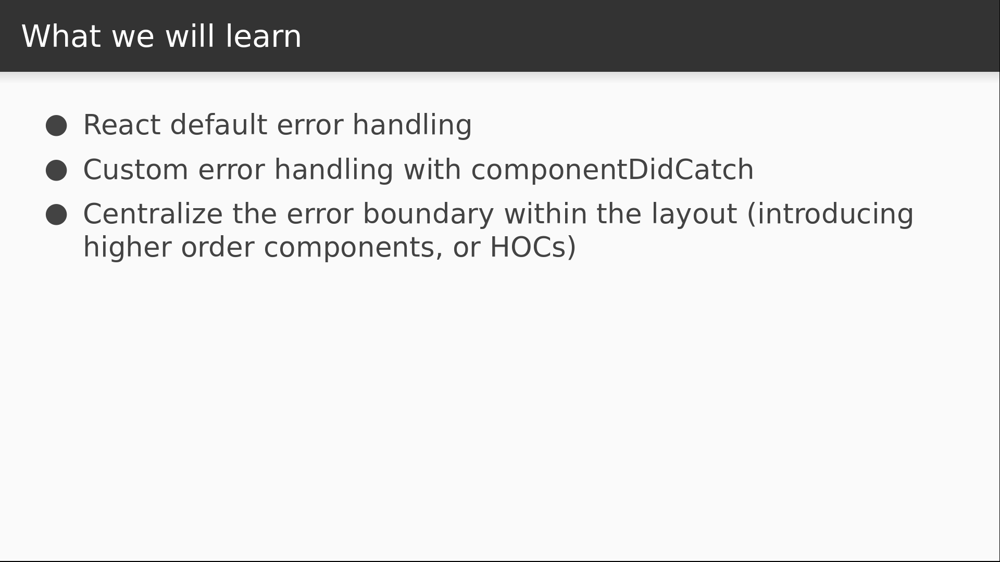

# Video 1.5

## Opening Slides


Hello and welcome to _Using Error Boundaries in React 16_. In our last video we used the `styled-components` library to create a layout out of declaratively styled, presentational React components. Today we'll be talking about how to gracefully handle errors in React applications.



We'll start with a brief discussion of how React handles errors by default. Then we'll introduce a basic error boundary for some custom handling. We'll then make our error boundary easier to reuse by introducing higher order components into our code.

## Content

_open Home.js_

Possibly the simplest way to see how errors are handled by default is to create one. So let's just throw an error here in our Home component and see what happens in the app.

```javascript
export default function Home() {
  throw new Error();
  ...
}
```

_check browser_

The first thing that we see is an overlay with a stack trace. This is actually provided by `create-react-app` and only shows up in development mode. We can dismiss the overlay and observe that there's nothing but blank screen behind it.

_dismiss_

This would actually be true no matter how deep in the hierarchy the error occurred, because the exception is unhandled, and React responds to this by completely unmounting the component tree. But we can actually use a component lifecycle method called `componentDidCatch` in order to intercept the error and display a different component tree in place of what was supposed to be rendered. Let's try this in our App component.

_Open App.js_

We'll keep a state variable indicating whether or not an error has occurred, and we'll flip it to true during `componentDidCatch`.

```javascript
  state = {
    error: false
  };

  componentDidCatch() {
    this.setState({ error: true });
  }
```

Then we can read from this variable in our render method and return something different if it's true.

```javascript
  render() {
    if (this.state.error) {
      return <h1>Woops!</h1>;
    }

    return <Home />;
  }
```

_back to browser_

Now when we dismiss the overlay we see the heading. Of course while we're in development, the stack trace in the overlay is more helpful. But these error boundaries are actually quite handy in production for presenting something more user friendly if unexpected errors occur. When this happens, it would be nice to still have the layout visible so that users can navigate through the site, and display a simple error message in the main content area. So that's what we're going to do next.

_back to App.js_

Let's start by yanking this code out into a cross-cutting ErrorBoundary component and restoring the App component to its previous state.

_yank, undo changes to App.js, create ErrorBoundary.js_

We just need to change the name to `ErrorBoundary`, and instead of rendering the `Home` component, we'll assume that this component was provided with some child elements, so we'll just render the children when there are no errors.

```javascript
import React, { Component } from "react";

export default class ErrorBoundary extends Component {
  state = {
    error: false
  };

  componentDidCatch() {
    this.setState({ error: true });
  }

  render() {
    if (this.state.error) {
      return <h1>Woops!</h1>;
    }

    return this.props.children;
  }
}
```

Now what we need to do is incorporate this component into our layout.

_open Layout.js_

What we might be tempted to do here is just import the component and wrap it around our `renderContent` call.

```javascript
import ErrorBoundary from "./ErrorBoundary";

...

      <ErrorBoundary>
        {renderContent()}
      </ErrorBoundary>
```

However, this won't really do what we want, because the child node supplied to the error boundary needs to be a component, or it won't actually catch any errors. One way we can solve this problem is by making what's called a higher order component in order to wrap a React component in a function that will display it inside of our layout with an error boundary around it. This technique is common but also fairly advanced in its use of functional programming, so we'll go slow. We start by exporting a function called `withLayout` that accepts a title.

```javascript
export function withLayout(title) {
}
```

Here's where the functional programming really comes into play. Our `withLayout` function is going to return another function that gets applied to a React component and returns _another_ component.

```javascript
export function withLayout(title) {
  return Component => props => (
  );
}
```

This can be confusing at first, but recall that React components can be pure functions that accept props and return some JSX. So that's what we're seeing here: the `Component` argument is a component whose behavior we want to extend, and when we apply our higher order component function to it, it returns a functional React component. In this case, that functional component is going to render our layout.

```javascript
  return Component => props => (
    <Layout
    />
  );
}
```

The layout component requires the title prop, which was passed into our `withLayout` function.

```javascript
    <Layout
      title={title}
    />
```

The `renderContent` prop is where we'll use the error boundary. This will be a function that returns the error boundary component, and as a child to the error boundary, we render the `Component` argument with all of the supplied props.

```javascript
      renderContent={() => (
        <ErrorBoundary>
          <Component {...props} />
        </ErrorBoundary>
      )}
```

That might be a lot to take in, but let's see what it looks like on the consuming end and the picture should get a bit clearer.

_open Home.js_

To start with, we no longer need the `Layout` component itself. Instead, we need the higher order component function we just defined.

```javascript
import React from "react";
import { withLayout } from "./Layout";
import { AppIntro } from "./styles";
```

Now our `Home` component will cease to be our default export. Instead, we apply our higher order function to it and export that as the default.

```javascript
export function Home() {
  ...
}

export default withLayout("Welcome to React!")(Home);
```

Now instead of rendering the layout, our `Home` component will just return the fragment that we were returning from our `renderContent` function to serve as the main content of the page.

```javascript
  throw new Error();
  return (
    <React.Fragment>
      <AppIntro>
        To get started, edit <code>src/App.js</code> and save to reload.
      </AppIntro>
      <h2>Hot reloading is really great when it works!</h2>
    </React.Fragment>
  );
```  

So let's pause for a moment and review what's happening. For starters, our `Home` component is now much simpler, only being responsible for the part that we want to show up in the main content area. By applying our higher order component function to it, we've created a new component that renders the layout, and then in the main content section, it renders the contents of our `Home` component inside of an error boundary.

_check browser_

So now in our browser when we dismiss the error overlay, we see exactly what we hoped for: the layout is still intact, and our error boundary has caught the error thrown from our `Home` component and displayed a simple error message in its place. Now that we know our error boundary works, let's remove the `throw` statement that we were using to test it.

_remove throw statement, return to browser_

And now everything's back to normal. Today we learned how to use error boundaries in React 16, and how to extend behavior of simple React components by using higher order component functions.


Join us for our next section where we'll focus on how data flows in a React application.
