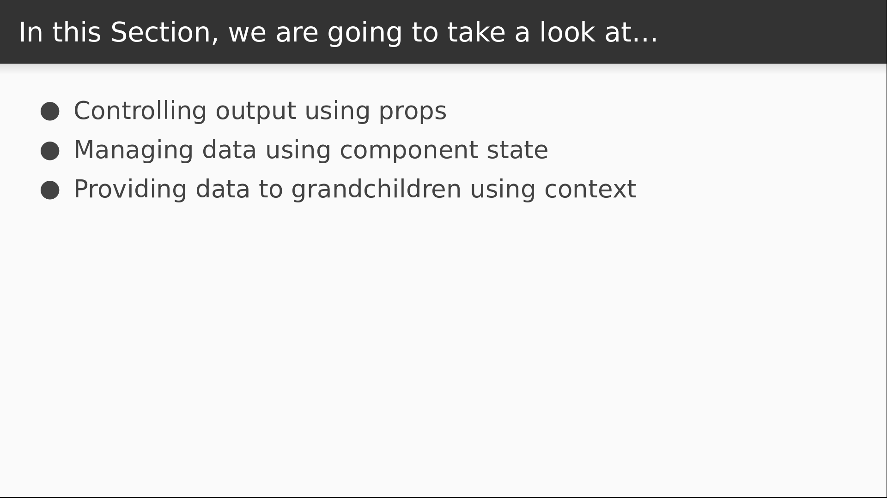
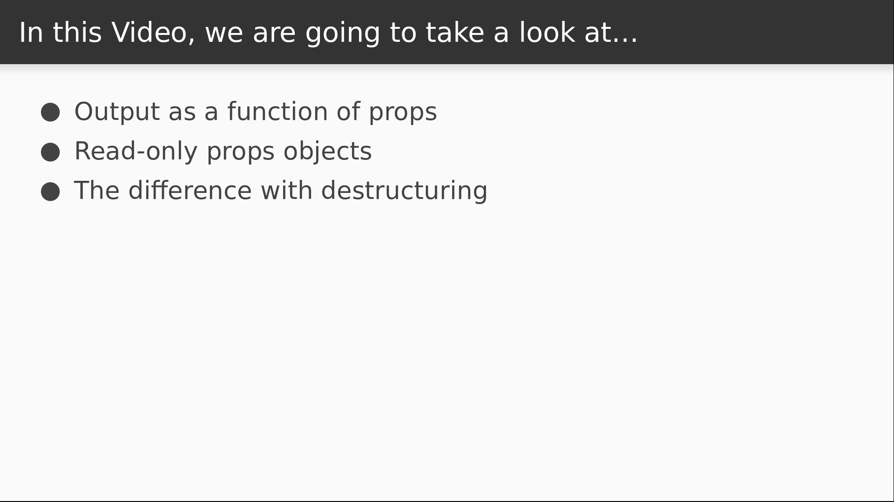

# Video 2.1

## Opening Slides


Hello and welcome to _One Way Data Flow_. In this section we'll be discussing how data flows in a React application, and how to manage it.



We'll start by learning how props are passed into components to control their output. We'll then see how to use React component state in order to manage data that changes as a result of user interactions or other events. Then we'll talk about using context to provide props to components deeper in the hierarchy without passing them down explicitly.


Today's lesson focuses on props. In our last video we saw how to leverage error boundaries to catch unexpected errors in production without bringing down the whole page. Today we start learning about data management with React component props.



This begins by passing named values, or props, from parent components to their children in order to bind data to our views and control the output. We'll then observe what happens when we try to change these values, and also discuss some subtle differences when using destructuring.

## Content

_open Layout.js_

We've already seen both props and state in action, but haven't really talked about what's going on. In this `Layout` component, we have a string prop called `title` and a function prop called `renderContent`, and the component needs both of these to function correctly. You might also notice that our `AppLogo` component accepts a couple of props as well. In this case, they are properties that are used by the native image node, and our styled component simply passed them along. But when you make a React component, you decide how to use those props. To demonstrate further, let's add a prop to our `Home` component.

_open App.js_

I'm just going to pass a `message` property into it.

```javascript
    return <Home message="Hot reloading is great!" />;
```

I can actually pass anything I want to into a component, regardless of whether or not it will be used. For better or worse, this code will compile with no errors or warnings, and all these named values will be assembled into a single `props` object that the child component receives.


For performance reasons, you should avoid passing any props that aren't going to be used. This will help you avoid unnecessary re-renders, because React components re-render when their props are changed.

_open Home.js_

With that warning out of the way, let's make use of our `message` prop by removing the text from our `<h2>` tag and putting the message in its place.

```javascript
export function Home(props) {
  return (
    <React.Fragment>
      ...
      <h2>{props.message}</h2>
      ...
  )
}
```

_check browser_

The result is fairly uninteresting since the output didn't change at all. But what we're observing is a fundamental concept of React: the output of a component is a function of its props. Because of this, the output is _predictable_. This is a major advantage that real data binding solutions have over using something like jQuery: we can always be sure what our output looks like just by knowing what the input is.

_back to Home.js_

The importance of this principle can't be understated. Being able to predict the output based on props is so crucial that the React team made a decision to _freeze_ the props object, making it completely immutable. If you don't believe me, let's try changing it and find out.

```javascript
export function Home(props) {
  props.message = "foo";
  ...
}
```

_back to browser_

As you can see, we've caused an error because we tried to write to a read-only object. This is really good protection to keep our output pure and predictable. But it doesn't quite work like this when we use destructuring in our function signature, so let's take a look at what happens there.

_back to Home.js_

In ES6, if your function is expecting an object, you can use destructuring in the function signature. This allows us to reference the props as variables instead of as members of the `props` object.

```javascript
export function Home({ message }) {
  ...
}
```

This is actually really handy, but watch what happens when I reassign to the `message` variable.

```javascript
export function Home({ message }) {
  message = "foo";
    ...
      <h2>{message}</h2>
      ...
}
```

_back to browser_

As you can see, we successfully reassigned the value of our message, and we can see it there on the screen. Unfortunately, nothing stops us from doing this. However, reassigning a prop value inside a render function is not something that most people will be tempted to do, because usually we want to change a value as a result of a user interaction. So let's see if that's possible. I'll add a button that updates the value of `message` when it's clicked.

```javascript
      <h2>{message}</h2>
      <button onClick={() => (message = "foo")}>Click me!</button>
```

Let's test it out.

_back to browser, click button_

As you can see, clicking the button has no effect at all. So the question arises: how _do_ we update data as the result of user interaction? The answer is with component state, which we'll discuss in our next video. Today we learned about how props are used in a React application to control the output of components.


Join us for our next video where we'll see how to use component state to update values in response to user interactions.
