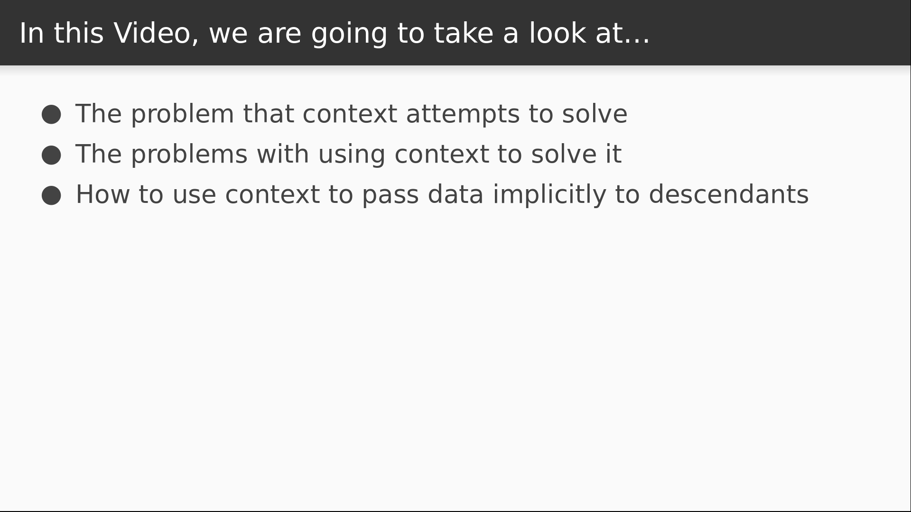

# Video 2.3

## Opening Slides


Hello and welcome to _Using Context_. In our last video we saw how to use component state in order to manage data in a React application. Today we'll see how to leverage context in order to make data available to nodes further down in the tree without passing them explicitly as props.



We'll start with an explanation of the problem we're trying to solve, and also discuss some of the pitfalls of using context to do it. Then we'll see how to use context as it's currently implemented in React 16.

## Content

_open Greeting.js_

To keep things simple, let's assume that I have `Greeting` component that I want to use for displaying the message that currently shows up in our `Home` component.

```javascript
import React from "react";

export default function Greeting({ message }) {
  return <h2>{message}</h2>;
}
```

This is pretty simple to solve.

_open Home.js_

I just render the `Greeting` component from the `Home` component and pass the message along.

```javascript
import Greeting from "./Greeting";

export function Home({ message, updateMessage }) {
  ...
      <Greeting message={message} />
  ...
}
```

This really isn't bad, but you can imagine that if I had a really deep component hierarchy, it would be a lot of repetitive pass through to get data down to the leaves. One way to solve this is with React context.


We're going to learn how to use it today for completeness, but be aware that the React team advises against using context. The main reason is that it's unstable and likely to change significantly in future releases. However, the data store solutions we'll be reviewing later in the course currently use React context under the hood in order to bind to the view layer, so it's important that we understand how it works.

_open terminal_

Before we can use context, we have to install a package called `prop-types`, because React requires us to declare types for the data that we make available in context.

```
$ yarn add prop-types
```

_open App.js_

Now we need to declare which data will be made available in the context. This starts by declaring a static `childContextTypes` variable that uses prop-types, which I like to name `T` for short.

```javascript
import T from "prop-types";
import Home from "./Home";

class App extends Component {
  static childContextTypes = {
    message: T.string
  };
}
```

Then we define a method called `getChildContext` that returns the actual data that makes up our context. In this case we will get the `message` from our `state` variable.

```javascript
  getChildContext() {
    return { message: this.state.message };
  }
```

Now we need to make some similar changes to our `Greeting` component so that it can make use of this context.

_open Greeting.js_

We use `prop-types` again in order to declare a static `contextTypes` object on the `Greeting` component.

```javascript
import T from "prop-types";

...

Greeting.contextTypes = {
  message: T.string
};
```

Now to use context in a functional component, we add it as the second argument to the signature. We won't use props anymore in this component so I'll use an underscore to indicate that it's an unused variable. Then I just take the `message` off of the `context` object instead of the props.

```javascript
export default function Greeting(_, context) {
  return <h2>{context.message}</h2>;
}
```

_open Home.js_

We might as well also remove the `message` prop from our `Home` component.

_remove prop from signature and from Greeting_

And while we're at it let's stop passing the `message` into this component as well.

_open App.js, remove message prop from Home_

So once again we shouldn't notice much difference in the app.

_check browser_

Everything looks the same and the button that changes our `message` text still works. We simply passed the data down in a different way, using context instead of props.


But it bears repeating that this isn't a technique we should really use, and in reality, you probably won't need it anyway. Most people will use a third party data store solution like redux to solve the problem of centralized state management. Those libraries might use context under the hood for their UI bindings today, but when the context API changes in later releases, they'll change how their internals work and users shouldn't notice much difference.


That completes our section on data flow in React. Today we learned how to use context to make data available to descendant nodes without passing it down explicitly. Join us for the next section, where we'll build a data store using our own implementation of the Flux pattern.
