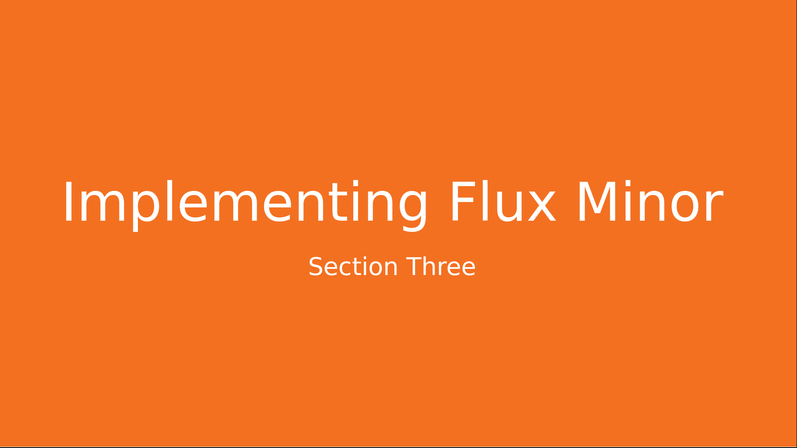
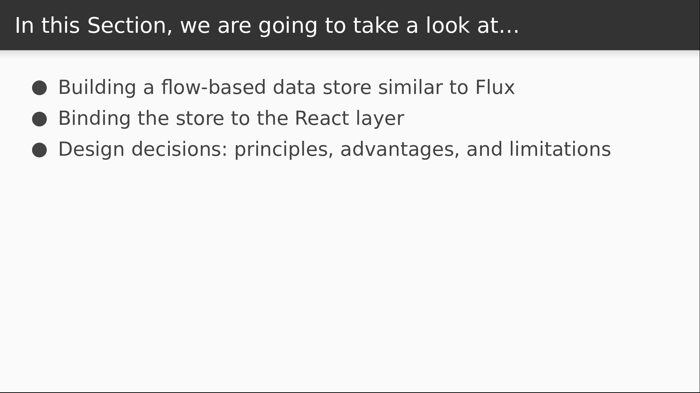
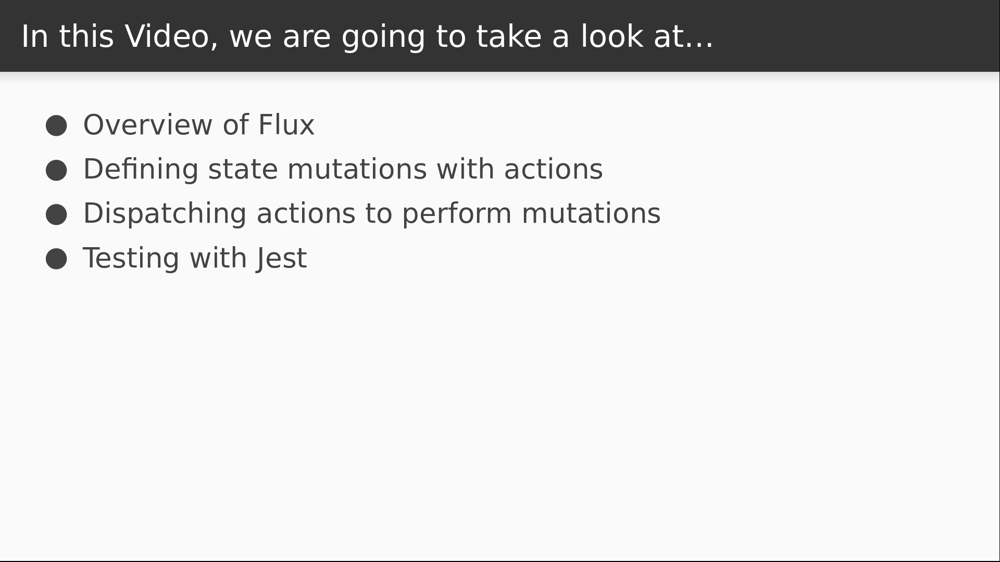

# Video 3.1

## Opening Slides



Hello and welcome to _Implementing Flux Minor_. In this section we'll be build a data store using a design based on the Flux pattern, which we'll call _Flux Minor_.



We'll begin by building a store that contains our application state and has the ability to make updates to it. We'll then spend two lessons learning how to bind our data store to the view layer using subscriptions. We'll close with a reflection on the design decisions we made, like immutability and functional programming, as well as some of the limits of our design.


Today's lesson focuses on using a data store. In our previous video we saw how to use React context to make data implicitly available further down in the component hierarchy. Today we'll build a centralized data store that's capable of storing and updating the state for our entire application.



We'll begin with a quick overview of the Flux pattern itself. We'll then build out the logic for managing the state. This starts by defining a set of possible state mutations, which we'll refer to as actions. Then we'll write a bit of code that applies those mutations to the application state. We'll also be testing our code along the way using Jest.

## Content

_open Flux diagram_

Before we start coding, let's review quickly what Flux is at a very high level. These diagrams are basically it in a nutshell. We don't need to fully understand what these pieces do right now, but we should keep this picture in our heads as we're learning the parts. The gist of it is this: the store contains the data that gets displayed by the view. A user interaction sends an action to the dispatcher. The action describes a state mutation, and the dispatcher sends this to the store, which uses the mutation to update itself. The view layer is then notified and can update itself with the changes.

_open store.js_

For today, we can pretend the view doesn't exist. We'll be building out a lightweight version of everything else, where simple actions do most of the work. So we'll begin with those. Let's imagine that we're building a simple counter application, and our application state is an object with a single member variable `n`.

```javascript
// const state = { n: 0 }
```

So we need to define actions to describe what sorts of mutations are possible. One easy way to do this is with a function that takes the current state and returns a new state. So for example, an `increment` action would be a function that accepts a `state` argument, and returns a copy of the state with `n` incremented by one.

```javascript
export const increment = state => ({ ...state, n: state.n + 1 });
```

Notice an important point here that we'll keep coming back to: the incoming `state` variable isn't modified itself, we're returning a copy instead. An action by itself should just be a _description_ of the mutation that's taking place, and should not create side effects by making changes to input. Let's define a `decrement` action in the same fashion.

```javascript
export const decrement = state => ({ ...state, n: state.n - 1 });
```

We're now ready to write our first tests.

_open store.test.js_

We want to make sure that our actions do what they say, so we'll import them both and test them against some input.

```javascript
import { increment, decrement } from "./store";
```

The first test will ensure that `increment` will add one to our `n` variable.

```javascript
test("increment action can increment some value n", () => {
});
```

So if we define our state object with an `n` equal to zero, we should be able to feed that to the `increment` function, and the `n` that comes out of it should be larger by one.

```javascript
  const state = { n: 0 };
  expect(increment(state).n).toBe(state.n + 1);
```

I can make a nearly identical test for the `decrement` action.

```javascript
test("decrement action can decrement some value n", () => {
  const state = { n: 0 };
  expect(decrement(state).n).toBe(state.n - 1);
});
```

At this point we can run our tests.

_open terminal_

 `create-react-app` comes with Jest built in, and running the `yarn test` command will run Jest in watch mode so that our tests will be executed whenever we make a code change.

 ```
 $ yarn test
 ```

 The output reveals that all of our tests are passing, so we can be confident that our actions work like they expect.

 _back to Flux diagram_

But actions by themselves don't do anything. According to this diagram, we still need a store and a dispatcher to tie this stuff together. So let's create those next.

_open store.js_

To create a store, we'll define a function called `createStore` that accepts the initial state of our application.

 ```javascript
export function createStore(initialState) {
}
```

We can then save the `initialState` as our `currentState`, and then expose a function called `getState` that returns the `currentState`.

```javascript
  let currentState = initialState;

  const getState = () => currentState;

  return { getState };
```  

This is still fairly uninteresting but let's test this function before we move on.

_open store.test.js_

We need to import the `createStore` function first.

```javascript
import { increment, decrement, createStore } from "./store";
```

Now we'll use a `describe` block to set up a few tests against our data store. We'll define an `initialize` function that will return a new store with an initial state where `n` is set to zero.

```javascript
describe("store", () => {
  const initialState = { n: 0 };
  const initialize = () => createStore(initialState);
});
```

Now we can write a test against our `getState` function to make sure that it returns the initial state.

```javascript
  it("returns the initial state", () => {
    const store = initialize();
    expect(store.getState()).toBe(initialState);
  });
```

_check test output_

We see that our new test has passed. We are really close to being done.

_open store.js_

We just need to define the `dispatcher`, which is actually going to be exposed from the store itself. This will just be a function called `dispatch` that accepts an `action` as its only argument.

```javascript
  const dispatch = action => {
  };
```

 Then we reassign to the `currentState` variable the result of passing our `currentState` into the action, which returns our next state.

```javascript
  const dispatch = action => {
    currentState = action(currentState);
  };

  return { getState, dispatch };
```

We then expose the function from the store object that we're returning. We're ready to test this now.

_open store.test.js_

So we'll write tests that dispatch actions against the store and verify that the internal state has changed. Let's do `increment` first.

```javascript
  it("can increment the internal state", () => {
  });
```

We initialize the store, dispatch the action, and make sure that `n` has increased by calling `getState` to check the state of the store.

```javascript
    const store = initialize();
    store.dispatch(increment);
    expect(store.getState().n).toBe(initialState.n + 1);
```

We do the same thing for the decrement action.

```javascript
  it("can decrement the internal state", () => {
    const store = initialize();
    store.dispatch(decrement);
    expect(store.getState().n).toBe(initialState.n - 1);
  });
```

_check test output_

All of our tests are passing so our store must be working like we expect. That's all the time we have for this lesson. Today we learned how to implement a data store using _Flux Minor_, a flow-based data store that's based on Flux.


Join us for our next video where we'll see how to bind our data store to our view layer.
