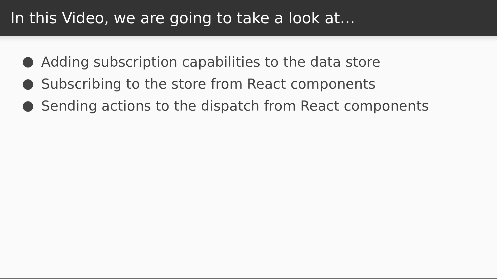

# Video 3.2

## Opening Slides


Hello and welcome to _Binding to the View Layer_. In our last video we created a flow-based data store based on the Flux design. Today we'll see how to make use of our data store from our React components.



We'll start by establishing a way to subscribe to the changes in our data store. We'll then make a small Counter app by creating a component that subscribes to the store and sends actions to the dispatch.

## Content

_open store.js_

So let's get started by exposing some subscription functionality. We'll maintain a simple array of listeners that will be invoked whenever an action is dispatched.

```javascript
export function createStore(initialState) {
  let currentState = initialState;
  const listeners = [];
  ...
}
```  

Next we'll modify the `dispatch` function to notify all of our listeners of the state change.

```javascript
  const dispatch = action => {
    currentState = action(currentState);
    listeners.forEach(l => l(currentState));
  };
```

The subscribe function accepts a listener callback and pushes it onto our array.

```javascript
  const subscribe = callback => {
    listeners.push(callback);
  };
```

Then we'll have an unsubscribe function that will remove a listener from the array as long as it exists.

```javascript
  const unsubscribe = callback => {
    if (listeners.includes(callback)) {
      listeners.splice(listeners.indexOf(callback), 1);
    }
  };
```

Then we just expose these new functions on our store.

```javascript
  return { getState, dispatch, subscribe, unsubscribe };
```

That's the easy part. Now it's time to make a component that uses this stuff.

_open Counter.js_

This component is going to act as a counter application, and for now we're going to create a single-use store that only our `Counter` component can access.

```javascript
import React, { Component } from "react";
import { createStore, increment, decrement } from "./store";

const counterStore = createStore({ n: 0 });
```

We'll then define our component and set the initial state to the state of the counter store.

```javascript
export default class Counter extends Component {
  state = counterStore.getState();
}
```

Next we define the listener that we'll be using to subscribe to the store. This is going to check if the component is mounted, and if it is we'll call `setState` with the new state.

```javascript
  refresh = newState => {
    if (this.mounted) {
      this.setState(newState);
    }
  }
```  

So when our component mounts, we'll set the `mounted` flag to true and subscribe to the counter store.

```javascript
  componentDidMount() {
    this.mounted = true;
    counterStore.subscribe(this.refresh);
  }
```

When we unmount, we'll set the `mounted` flag back to false and unsubscribe.

```javascript
  componentWillUnmount() {
    this.mounted = false;
    counterStore.unsubscribe(this.refresh);
  }
```

Let's pause for a second and talk about the `mounted` flag. It's possible that we'll wind up with a bit of a race condition where our `componentWillUnmount` logic will be scheduled to execute immediately before our listener is invoked. If that happens, `setState` could be called on an unmounted component, which is better to avoid. So by setting this flag at the right time and checking it in our listener, we make sure to skip the `setState` call if the component is no longer being displayed.

So moving on now, the next thing our component needs is a set of methods for incrementing and decrementing our counter. These will just send actions to the dispatcher of our counter store.

```javascript
  inc = () => counterStore.dispatch(increment);
  dec = () => counterStore.dispatch(decrement);
```

Now our render method will display buttons for incrementing and decrementing, and it'll display the count in between them.

```javascript
  render() {
    return (
      <div>
        <button onClick={this.inc}>+</button>
        <h2>{this.state.n}</h2>
        <button onClick={this.dec}>-</button>
      </div>
    );
  }
```

Last step before we can use our counter app is to render it from our `Home` component.

_open Home.js_

That's as simple as importing it and rendering it with no props.

```javascript
import Counter from "./Counter";
      ...
      <Greeting />
      <Counter />
```

_check browser_

So here's our counter app that starts at zero, and I can click my buttons to move it up and down. Our approach leaves some things to be desired, but we're out of time for this lesson. Today we learned how to bind our data store to a single React component.


Join us for our next video where we'll see how to make the store easily accessible to the rest of our app using a higher order component.
