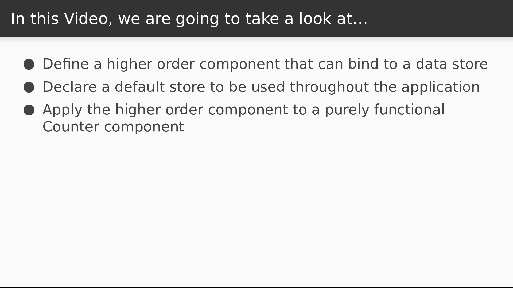

# Video 3.3

## Opening Slides


Hello and welcome to _Better View Binding_. In our last video we made a component that subscribes to our data store as a way to bind it to the view layer. Today we'll improve on that by making our store more easily accessible to any component in the application.



We'll do this by extracting the logic from the last video into a higher order component. Then we'll rewrite our `Counter` component as a pure function that uses our new HOC.

## Content

_open connect.js_

So let's start defining our higher order component. We're going to call it `connect` because it connects a component to our store.

```javascript
export default function connect() {
}
```

If you've used `react-redux` before then this probably looks familiar, but hang tight either way because ours won't be quite the same. Our function will take two arguments, and the first will be a function that returns some component props.

```javascript
selector = () => ({})
```

As a default value, we'll give it a function that returns an empty object. Now for the second argument, we're going to accept a data store, but to keep things simple, I'm going to create a new store statically and use that by default.

```javascript
import { createStore } from "./store";

const defaultStore = createStore({ n: 0 });

export default function connect(selector = () => ({}), store = defaultStore) {
}
```

Note that I'm intentionally violating some boundaries here just to keep things simple, but for our purposes this will be pretty convenient. We're basically making sure that all of our connected components are subscribing to the same store, unless we pass in a different one. So the next step from here is to return a higher order component function. Just like we did for our layout back in the first section, we return a function that takes a component and returns another component.

```javascript
  return Component =>
    class extends React.Component {
    }
```

Last time we did this, the component we returned was a pure function. This time we'll be returning a component class that does basically what our `Counter` component was doing to subscribe to the store. So we can copy what's in there and just make some changes.

_open Counter.js_

The initial component state, the listener, and the lifecycle methods don't change at all except for some variable names.

```javascript
      state = store.getState();

      refresh = newState => {
        if (this.mounted) {
          this.setState(newState);
        }
      };

      componentDidMount() {
        this.mounted = true;
        store.subscribe(this.refresh);
      }

      componentWillUnmount() {
        this.mounted = false;
        store.unsubscribe(this.refresh);
      }
```

Now for the render method, we want to render the `Component` that we're decorating with our HOC.

```javascript
      render() {
        return (
          <Component
          />
        );
      }
```

For props, we'll first pass in whatever props the parent component provided.

```javascript
          <Component
            {...this.props}
          />
```

Next we'll use our `selector` function. The first argument to the selector is our current application state, which is returned from the `getState` function. As a second argument, we'll also provide the props that we're passed down from the parent.

```javascript
          <Component
            {...this.props}
            {...selector(store.getState(), this.props)}
          />
```

Then we'll pass the store's dispatcher into the component as well.

```javascript
          <Component
            {...this.props}
            {...selector(store.getState(), this.props)}
            dispatch={store.dispatch}
          />
```

Now let's go back to our `Counter` component and apply our connector to it.

_open Counter.js_

We can now import our `connect` function, delete most of this code, and redefine our `Counter` component as a pure function that takes our `n` variable and the `dispatch`. All else remains essentially the same except for how we reference our variables.

```javascript
import React from "react";
import connect from "./connect";
import { increment, decrement } from "./store";

export function Counter({ n, dispatch }) {
  const inc = () => dispatch(increment);
  const dec = () => dispatch(decrement);

  return (
    <div>
      <button onClick={inc}>+</button>
      <h2>{n}</h2>
      <button onClick={dec}>-</button>
    </div>
  );
}
```

Then we just need to apply the `connect` function to the counter component.

```javascript
export default connect(state => state)(Counter);
```

For the selector function, since `state` is just an object that contains a single member variable `n`, I'll just return the whole thing. Now this higher order component has injected the variable `n` from the application state as well as the store's `dispatch` into the `Counter` component. Our app should now function exactly as it did before.

_open browser_

As you can see, we can still increment and decrement our counter as we did before. It doesn't look like anything changed, but really a lot has, because we can now apply our higher order component to any of our React components and give them access to the same data store that our `Counter` component is using. That's all the time we have for this lesson.


Join us for our next video, where we'll talk about some of the design decisions we made for our data store and reflect on the pros and cons.
