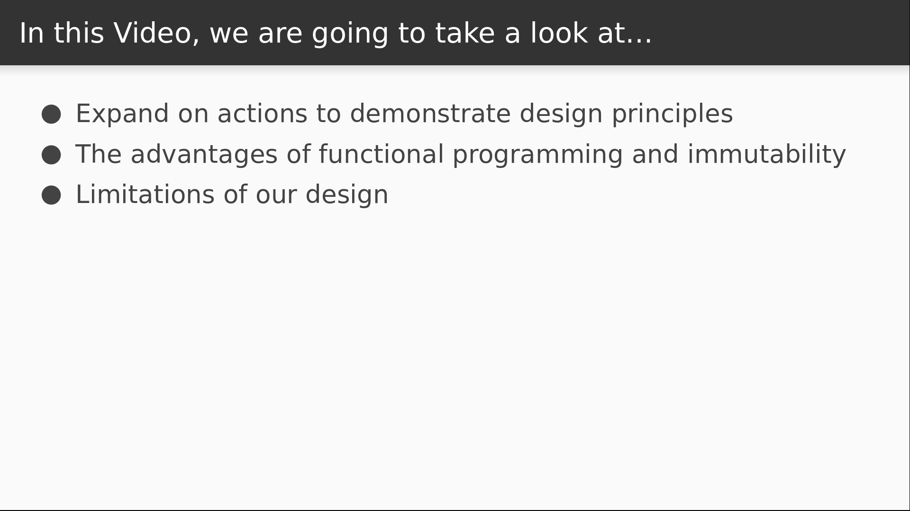

# Video 3.4

## Opening Slides


Hello and welcome to _Design Decisions_. In our last video we created some reusable view layer bindings for the data store that we've been building throughout this section. Today we're going to discuss the implications of our design.



To help highlight our points, we'll be adding some features to our actions. We'll be focusing on the benefits of functional programming and immutability, as well as some of the limitations that our design has imposed on us.

## Content

_open actions.js_

To separate concerns a bit better, I've pulled our actions out into their own file and updated the references. My app and my tests are both running in watch mode and everything is working. So let's take a second to talk about these actions.

```javascript
export const increment = state => ({ ...state, n: state.n + 1 });
export const decrement = state => ({ ...state, n: state.n - 1 });
```

The actually share something in common with some of our React components: they are pure functions. That means that the output is a function of the input, and it also means that no side effects are created. I could call these functions a thousand times and nothing in my application would change. Not unless I actually _dispatched_ them, which is how we cause a state mutation. So what are some advantages to this kind of programming?

_open store.test.js_

For starters, ignoring the fact that my action tests shouldn't be in this file, it's easy to see that pure functions are easy to test. All you need is some input to the function, and then you can make assertions about the output. You don't need to mock anything, or worry about some kind of global state changing, requiring you to reset it. The behavior is highly predictable, and the advantages of predictable code can't be understated.

_back to store.js_

Functional programming can also be powerful and elegant. In truth, what I have here is a little redundant, and I can clean it up easily with better functional programming. Let's define a higher order function called `inc`.

```javascript
export const inc = step => state => ({ ...state, n: state.n + step });
```

Remember that a higher order function is just a function that returns another function. In this case, our higher order function takes a `step` argument and returns an action. Our action describes a mutation that changes `state.n` by the number specified in step. Now I can redefine `increment` and `decrement` like this:

```javascript
export const increment = inc(1);
export const decrement = inc(-1);
```

_check tests & browser_

Tests are still passing, app still works like before. So now we can have even more fun with this.

_open Home.js_

Let's say I want my counter app to increment and decrement by a different step size. We'll use a step size of three.

```
      <Counter step={3} />
```

_open Counter.js_

Now I can import my higher order function, which I'll rename just to prevent confusion.

Then I'll add the `step` property to my function signature,

And then for my event handlers I'll increment either by `step` or negative `step`.

```javascript
import { inc as increment } from "./actions";

export function Counter({ n, step, dispatch }) {
  const inc = () => dispatch(increment(step));
  const dec = () => dispatch(increment(-step));
}
```

_check browser_

Now my counter counts by threes instead of ones. But you know what, we can still have a lot more fun with this.

_open Counter.js_

I'd really like to tidy up the way that we are defining our event handlers. Using arrow functions and referencing the dispatch really seems like a bit much. The answer is actually going to be more functional programming.

_open connect.js_

So here we our back in `connect.js`, which is what we're using to bind our components to the store. I'm going to define what I'll call a higher order dispatch event. This will be a component method called `send`.

It accepts an `action`, and it returns another function.

This function is just an event handler. When it's invoked, it dispatches the action.

```javascript
      send = action => () => store.dispatch(action);
```

So now instead of passing in the dispatch, I'll pass in our new `send` method.

```javascript
          <Component
            {...this.props}
            {...selector(store.getState(), this.props)}
            send={this.send}
          />
```

_open Counter.js_

Now back in my `Counter` component, I'll replace the `dispatch` with the `send` function in my component signature,

Then we can delete this click handlers and instead invoke the `send` function and supply the appropriate actions.

```javascript
export function Counter({ n, step, send }) {
  return (
    <div>
      <button onClick={send(increment(step))}>+</button>
      <h2>{n}</h2>
      <button onClick={send(increment(-step))}>-</button>
    </div>
  );
}
```

_check browser_

Just a quick check to make sure everything's still working.

Now I want to talk a bit about a separate but related design decision.

_open actions.js_

We've talked about how our pure functions don't actually mutate their input. Instead, the return something that's computed based on that input. For example, our action returns a copy of the state with some properties changed, rather than changing the incoming state object directly. This concept is called immutability, which basically means that we don't ever alter data that's passed to us.

_open Counter.js_

This really goes hand in hand with how React works. Recall that the props object that gets passed to a React component is frozen so that a component cannot modify its own input. Any change to the data needs to take place somewhere higher up, and those changes will percolate down. So we are modeling our data management solution around the same principles. But it's important to note that our data is not _really_ immutable.

_open store.js_

Consider our `getState` function, which returns the whole state tree. If I grab a hold of this, I can overwrite any part of the tree that I want. Even if I use the spread operator to return a copy of the `currentState`, it's not a deep copy. If you have a reference to the state tree, you can easily do quite a lot of damage to it.

```javascript
  const getState = () => { ...currentState };

  // currentState.foo.bar = {}
```

_open ImmutableJS webpage in browser_

My developers will rely on discipline to avoid mutations, but if you want a guarantee, you might want to try [ImmutableJS]  (https://facebook.github.io/immutable-js/). This library provides a number of rich, immutable data structures that you can use to encapsulate your application state safely. Any operations that you perform on these structures will return a copy, so you can transform your data however you see fit without any change being persisted to the objects that were initially declared. We won't cover usage of ImmutableJS in this course, but I highly recommend checking it out to see if it's right for you.

_open flow docs_

Alternatively, if you use flow for static type checking, you can [declare variables to be immutable](https://flow.org/en/docs/react/redux/#typing-redux-state-immutability-a-classtoc-idtoc-typing-redux-state-immutability-hreftoc-typing-redux-state-immutabilitya) and the compiler will catch it if you try to reassign to them. There are most likely other solutions out there too if it's something that you think is crucial to your application.

_open flux docs_

https://facebook.github.io/flux/docs/in-depth-overview.html#actions

One last design decision I want to talk about is how we approached actions and the reason why we're referring to this design as _Flux minor_ instead of Flux proper. If we were really using Flux, our actions would be plain JavaScript objects with a `type` property and some other data attached to it. The `type` property is a string that describes what's happening, and the rest is a data payload. The data store would listen for this type of action to be dispatch and then figure out how the state should be mutated. Let's see an example from a popular Flux implementation.

_open redux docs_

https://redux.js.org/

Here's a counter app a lot like ours, but the actions are plain javascript objects and then we have this `counter` function that decides how to mutate the state when an action is dispatched. We're going to see this in more detail in the next section, but it's worth talking about the difference now. Possibly the biggest advantage to doing it the Flux way is that we can capture complete information about everything that's happening in the application. These action payloads are serializable so we can very easily record the path that a user has taken in our application, which can be helpful to businesses in a number of ways. Our implementation does not support this, so we can't really call it Flux. Our store has the benefit of being really lightweight and requiring less code than Flux and Redux typically do, but this simplicity comes at a cost. It all depends on whether or not it's valuable to you to have the event history that something like Flux offers.

_open redux-zero npm page_

I also want to point out that although our implementation was different than Flux, it really wasn't all that original. There are a few libraries out there that take very similar approaches. `redux-zero` is a popular one that you might want to try out for yourself.

_open apothecary npm page_

However, if you're partial to the one we wrote, you can also download my library `apothecary`, which is almost identical to what we've done in the last few sections.


That concludes our section on building a data store for React. Today we focused on the benefits and limitations of our design, with emphasis on the power of functional programming. Join us for our next section where we'll rewrite our application using Redux.
