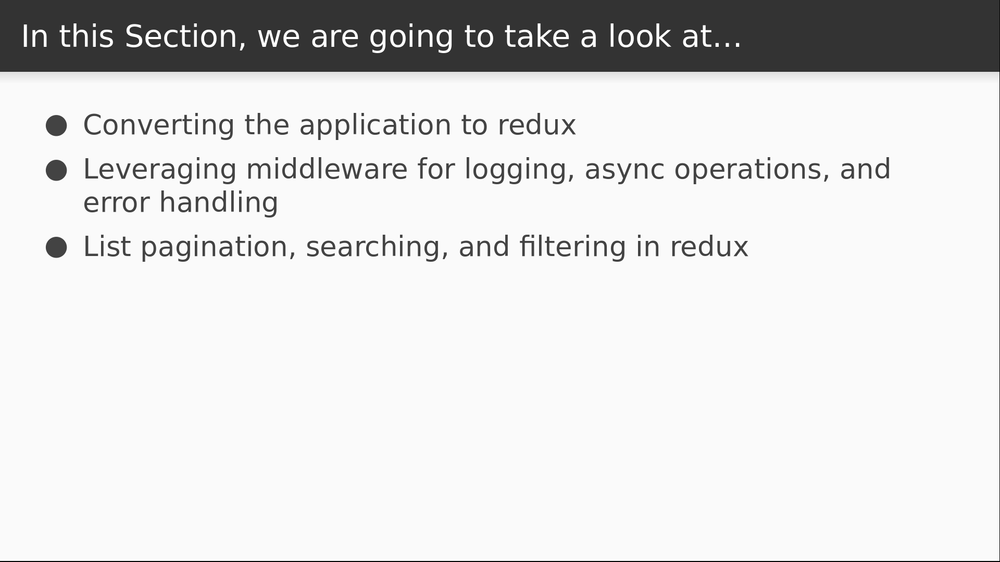
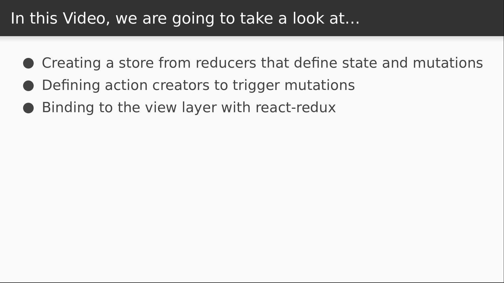

# Video 3.1

## Opening Slides


Hello and welcome to _Using Redux_. In this section we'll learn to leverage a popular data management library called Redux to build realistic React applications.



We'll begin by changing our application to use Redux in place of the homemade data store that we implemented in the previous section. We'll then look at functionality with Redux middleware, including asynchronous operations and logging. We'll then see how to use Redux to accomplish realistic tasks like filtering and paginating server data.


In today's video we'll be scrapping our data store solution and replacing it with Redux.



We'll start the section by converting our app to use redux instead of our own data store.
We'll be swapping out the parts of our implementation one by one. This starts by creating a store out of reducers that define the initial state and possible mutations, and then defining actions that trigger those mutations. After that we will update our view bindings to connect to the Redux store.

## Content

_open terminal_

Before we start coding, we'll want to install redux and react-redux.

```
$ yarn install redux react-redux
```

This gives us what we need to build a data store and bind it to the view layer.

_open store.js_

Our next step is to replace our data store with redux. We'll import the `createStore` function first.

```
import { createStore } from "redux";
```

Then we will define our initial state.

```
const initialState = {
  n: 0
};
```

Just like before, this is a plain JavaScript object with a single integer variable `n`. Next we'll define our mutation for changing the value of `n`.

```javascript
function inc(state, action) {
  return { ...state, n: state.n + action.n };
}
```

This is very similar to the mutation we used in our own implementation. All it does is return a copy of the state with the value of `n` changed. The main difference is that the value that we use to increment `n` is part of the `action` object that's supplied as a second argument. We'll see more how this ties in shortly, but for now, let's create our reducer function.

```javascript
function reducer(state = initialState, action) {
}
```

In redux, all state mutations happen inside of the reducer, and we see here that it's just a function that takes two arguments. The first is the current application state, which will default to our `initialState` object. The second argument is an `action` that describes the mutation that needs to happen. Our reducer needs to return a new copy of the application state based on the information that's supplied in the action.

```javascript
  switch (action.type) {
  }
```

In redux, an action must always have a type property. This is the first signal that a reducer uses to determine how to mutate the state.

```javascript
  switch (action.type) {
    case "INCREMENT":
      return inc(state, action);
  }
```

We're going to be listening for the `INCREMENT` action, and when it occurs, we'll call the `inc` function that we just defined in order to return a new state with the value of `n` modified. If we don't recognize the action, then we just return the state unchanged.

```javascript
  switch (action.type) {
    case "INCREMENT":
      return inc(state, action);
    default:
      return state;
  }
```

Now we can use our reducer as an argument to the `createStore` function and export the result.

```javascript
export default createStore(reducer);
```

This export will be the data store that we use for the application. The next step is to define the actions that will be dispatched to the store.

_open actions.js_

When we implemented our own data store, our mutations and our actions were basically the same thing, but in redux they are split into two separate concepts. We just defined a mutation in the reducer, but now we need to define an action that triggers that mutation.

```javascript
export function increment(step) {
}
```

An action is just a plain JavaScript object, and we define functions called action creators in order to generate them. Our increment action creator will take a step argument, and then it will return an action with a type of `INCREMENT.`

```javascript
export function increment(step) {
  return {
    type: "INCREMENT",
    n: step
  };
}
```

The `step` argument gets bound to the `n` property of our action, and that will be used in our reducer to change the value of `n`. This is really all we need for our data store, so all that remains is to bind to the view layer.

_open App.js_

The first step in this process is to wrap our application in a `Provider` component.

```javascript
import { Provider } from "react-redux";
```

This component will require a reference to our data store, so we'll import that too.

```javascript
import store from "./store";
```

Now we surround our application in the provider and pass in the store.

```javascript
      <Provider store={store}>
        <Home updateMessage={this.updateMessage} />
      </Provider>
```

The provider will now make the store available to the entire component tree. This actually works by using React context, but this fact is invisible to us because we access the data store by using a higher order component.

_open Counter.js_

```javascript
import { connect } from "react-redux";
```

This is very similar to what we wrote in the last section, and the functions even have the same name. The main difference is that we didn't use context in our implementation because we were able to get away with violating some boundaries, since we weren't sharing our solution.

```javascript
import { increment } from "./actions";
```

We also renamed our action from `inc` to `increment`, so we need to modify this import. Now we need to make a couple changes to our `connect` call because the API isn't quite the same. The first argument won't change: it's still a function that accepts the application state and returns some component props. But we're going to add a second argument in order to inject our action creators as component props.

```javascript
export default connect(
  state => state,
  (dispatch, props) => ({
    inc: () => dispatch(increment(props.step)),
    dec: () => dispatch(increment(-props.step))
  })
)(Counter);
```

This second argument is called `mapDispatchToProps` and there are a couple different ways to use it. In this case, we provide a function that accepts the `dispatch` and the props that were passed in from the parent component. We then are returning an object made of functions that dispatch our action creators to the store. These functions are injected as component props, hence the name `mapDispatchToProps`. So all that's left is a couple small changes to the component.

```javascript
export function Counter({ n, inc, dec }) {
}
```

We can scrap the `send` prop and replace it with our `inc` and `dec` functions.

```javascript
  return (
    <div>
      <button onClick={inc}>+</button>
      <h2>{n}</h2>
      <button onClick={dec}>-</button>
    </div>
  );
```

Then we just update our click handlers to invoke those functions.

_check browser_

A quick check in our browser reveals that everything works exactly as it did before. We've successfully replaced our own data store with Redux in just a few minutes! Today we learned the basics of setting up a redux store with reducers, dispatching actions, and binding to the view layer.


Join us for our next video where we'll dive further into the benefits of Redux actions and learn how to write some custom middleware to log changes to the store.
