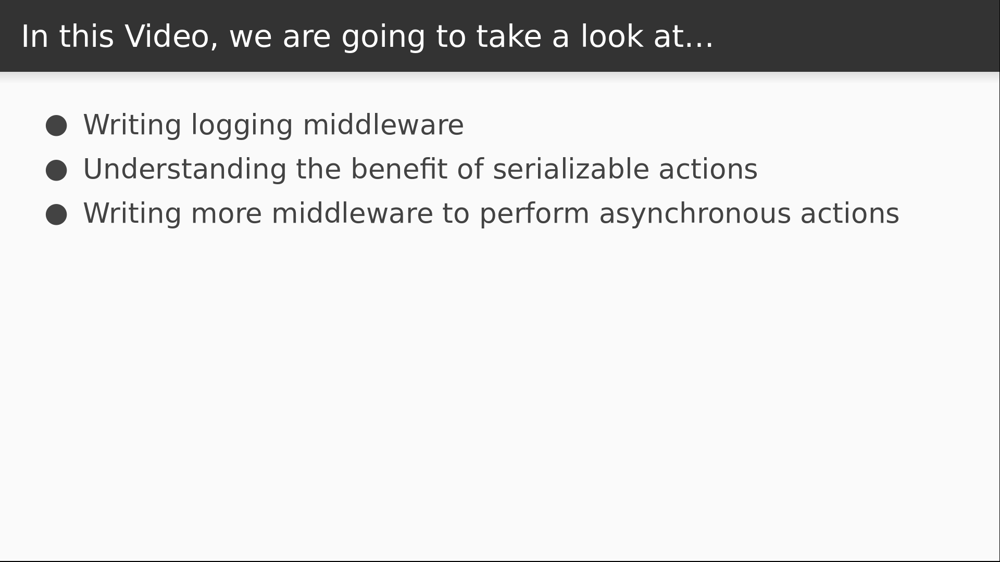

# Video 3.2

## Opening Slides


Hello and welcome to _Actions and Middleware_. In our last video we replaced our homemade data store solution with redux. In this video we'll take a deeper look at redux actions and learn how to write middleware to extend redux's built in functionality.



We'll begin by writing some logging middleware and using it as a basis for discussion about the advantages of using Redux actions. We'll then write some more middleware that will allow us to perform asynchronous actions.

## Content

_open actions.js_

Let's take a moment first to review the action creator that we made in the last video. An action creator is a function that returns a Redux action, and a Redux action is just a plain object. It has to have a type property so the reducer knows how to handle it, and then you can attach additional data to the action payload. Because of this, every message that's dispatched to the store is serializable. This is a big advantage because we can capture the entire history of events that occur in our application. In fact, we're about to write a utility that does precisely that.

```javascript
export function increment(step) {
  return {
    type: "INCREMENT",
    n: step
  };
}
```

_open store.js_

The redux library exports a function called `applyMiddleware` that we use to add middleware to the store.

```javascript
import { createStore, applyMiddleware } from "redux";
```

Redux middleware functions will intercept actions before they get to the store, allowing you to do some processing on them. They're defined as higher order functions.

```javascript
const logger = store => next => action => {
};
```

This is what the signature of any Redux middleware function looks like. The `store` argument is our Redux store, the `next` argument is the next middleware function in the chain, and the `action` argument is the Redux action that was dispatched. So from here we can log some stuff to the console, like the action itself and the current state of our store.

After printing that we hand our action off to the next middleware function in the chain and we save the result.

Once that returns, we know that our store has been updated, so if we print the current state again, it will have been mutated as a result of our action.

Then we just return the result.

```javascript
  console.log("dispatching", action);
  console.log("current state", store.getState());
  let result = next(action);
  console.log("next state", store.getState());
  return result;
```

Now we have to add this to our store with `applyMiddleware`.

```javascript
export default createStore(reducer, applyMiddleware(logger));
```

_open browser_

So if we open our console we should see our middleware at work as we dispatch actions.

_test_

Now with every action that gets dispatched, we can see the previous state, the action payload, and the resulting state. This can be really useful information for debugging production issues or understanding how your customers use your site. You could literally save this history of actions, start up the application, and dispatch them one by one to see exactly what a user is seeing. That is a key difference from our homemade data store, and one major advantage to using Redux.

_open store.js_

There really is a whole lot more that we can do with middleware, and one of the most common uses is to add support for asynchronous operations, like API calls. We usually want to save data to the Redux store after making an API call, and this can get a little bit awkward and messy without a reasonable abstraction, so let's write one now which we'll call `async`.

```javascript
const async = store => next => action => {
};
```

If you're familiar with `redux-thunk` middleware, you'll recognize this implementation, which is naive but quite effective. Before we write it, let's figure out how we want our async action creators to look. Imagine we have a CRUD application and we're submitting a new contact.

Rather than return a plain object, we need to be able to make an API call and dispatch an action when it's completed. So we're going to return a function that accepts the `dispatch` as an argument.

When this function is executed it will submit the contact data to the API, and then dispatch the `CONTACT_CREATED` action to save our new contact to the data store.

```javascript
//function createContact(contactData) {
//  return dispatch => api.contacts.create(contactData).then(response =>
//    dispatch({ type: 'CONTACT_CREATED', contact: response.data })
//  )
//}
```

So in order to be able to dispatch an action that looks like this, our middleware will check if the action being dispatched is a function.

If it is, it will call the function and pass in the `dispatch`. This is what would execute our API call in the example above.

If the action is not a function, then we can hand it off to the next middleware function.

```javascript
  if (typeof action === "function") {
    return action(store.dispatch);
  }

  return next(action);
```

Now we need to add our new middleware to the chain.

```javascript
export default createStore(reducer, applyMiddleware(async, logger));
```

So to test this out, let's modify our `increment` action to conform to this async interface.

_open actions.js_

We don't actually have an API right now, but we can fake one out by declaring a function that returns a promise.

```javascript
const incrementApi = n => Promise.resolve();
```

This will serve as a sort of mock API call, because HTTP request libraries normally return promises from their calls. So with this in place, let's redefine the `increment` action by returning a function that accepts the `dispatch` as an argument.

When it gets executed, it will call the `incrementApi`, and when that call returns we'll dispatch our `INCREMENT` action.

```javascript
export function increment(step) {
  return dispatch =>
    incrementApi(step).then(() => {
      dispatch({
        type: "INCREMENT",
        n: step
      });
    });
}
```

_open browser_

As you can see, our app still works as normal. Our async middleware intercepts our asynchronous action and executes it. Our asynchronous action then completed a phony API call and dispatched some plain Redux actions, which were filtered through our logging middleware and ultimately used to mutate the state of our Redux store.


That's all the time we have for this lesson. In our next video we'll continue exploring middleware as a means to handle errors in Redux.
