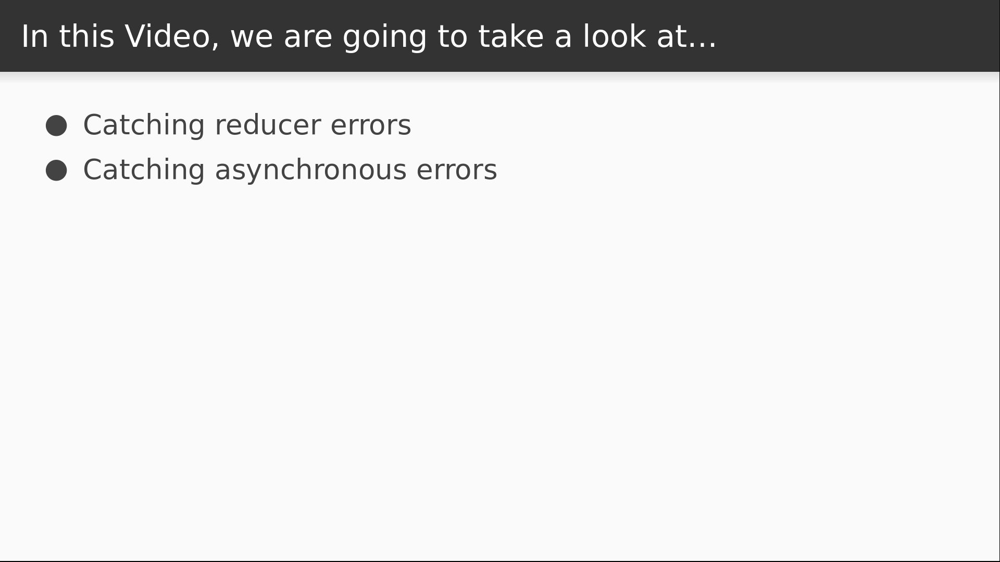

# Video 3.3

## Opening Slides


Hello and welcome to _Error Handling in Redux_. In our last video we wrote some middleware that for capturing event history and for handling asynchronous actions. Today we'll be using middleware to handle errors that happen outside of the React component hierarchy.



We'll start by handling errors that occur in our reducers. We'll then look at a couple ways to handle errors that occur during asynchronous operations.

## Content

_open store.js_

Let's review our reducer code.

```javascript
function inc(state, action) {
  return { ...state, n: state.n + action.n };
}
```

We currently only respond to the increment action, and when we receive it, we increment our `n` variable by whatever `n` is specified in the action. The way it's written, there's not much chance for an exception to occur, but we can change that by trying to drill deeper into our `action` for the value of `n`.


```javascript
  return { ...state, n: state.n + action.counter.n };
```

So for example, if I look for `n` behind `action.counter`, I should get an exception because `counter` is not defined.

_check browser_

Sure enough, this explodes and we see our error overlay. This sort of thing can be a bigger risk when using a language like JavaScript without the assistance of static type checking. Small code changes can sometimes be released completely untested. There are measures we should take to prevent this, but it would also be nice to have a fallback mechanism, so let's write some middleware to create one.

_open store.js_

Our new function will be called `reporter`.

All this will do is wrap the remaining chain in a try/catch block.

When an error occurs, for now we'll just log it to the console.

```javascript
const reporter = store => next => action => {
  try {
    return next(action);
  } catch (err) {
    console.log(err);
  }
};
```

Now we'll have to add it to our middleware chain.

```javascript
export default createStore(reducer, applyMiddleware(reporter, async, logger));
```

So let's try this out again.

_back to browser_

This time, the application swallows the error and we see it printed to the console.

_open store.js_

Of course, failing silently might not be what we want, and we have a few different options from here. For example, maybe we've integrated with an error reporting service like Sentry or Rollbar.

```javascript
// reportingService.captureError(err);
```

You could easily do that from here. After that, maybe you want to re-throw the error, or perhaps you want to dispatch an action that triggers your app to render a generic error page.

```javascript
    // store.dispatch({ type: 'APPLICATION_ERROR' })
```

For our purposes, we're just going to allow it to fail silently and move on to discussing another category of error.

_open actions.js_

In our last video we made our increment action into an asynchronous, phony API call for demonstration purposes, but we didn't really consider what would happen if that API call were to fail. We can simulate that with a `Promise.reject`.

```javascript
const incrementApi = n => Promise.reject({ status: 422 });
```

Let's see what happens in this case.

_open browser_

Here we see an error showing an unhandled promise rejection. So what can we do about this?

_open actions.js_

In fact there is a combination of things that we might want to do. In this case we're getting a 422 which might indicate some sort of validation error. We might want to handle that right here in the action and dispatch an action in response.

So for a 422 we'll send the VALIDATION_ERROR action to the store, and our reducer would probably set an error flag that would cause the UI to indicate a user friendly error.

Then for any error type that we're not expecting here, we can rethrow the error since we don't know how to handle it ourselves.

```javascript
      .catch(err => {
        if (err.status === 422) {
          dispatch({ type: "VALIDATION_ERROR" });
        } else {
          throw err;
        }
      });
```

_check browser_

So now we see that instead of an error, we're seeing our `VALIDATION_ERROR` message displayed by the logger. Alternatively, the error code might be a 401 or 403, indicating an authentication error of some sort. This is something that could happen on any authenticated endpoint and you want to always treat it the same.

_open [axios docs](https://www.npmjs.com/package/axios#interceptors)_

 In cases like these, whatever library you use to make HTTP requests probably comes equipped with an interceptor that you can hook up to handle specific status codes. Here's an example from the popular `axios` library. We won't cover this in depth, but in our case we'd probably use the `response` interceptor and check for a `401` status, which would maybe cause a redirect to the login page.

 _open store.js_

 But for any other error that might occur during an asynchronous action, we can handle it easily in our async middleware by adding a catch block to the call that executes our promise.

 For now, let's just log the error and swallow it.

 ```javascript
    return action(store.dispatch).catch(err => {
      console.log(err);
    });
  ```

  _open actions.js_

To demonstrate this one, let's just throw an error when our promise resolves.

```javascript
    incrementApi(step)
      .then(() => {
        throw { message: "whoops" };
        ...
      })
```

_check browser_

We see that our error gets swallowed and printed to the console.

_open store.js_

So from here we have the same options available to us as before. We can send the error to a reporting service, dispatch an action that results in a generic error page, or any combination of things. Redux middleware is powerful and flexible, and it's up to you to use it to your benefit.


That's all the time we have for this lesson. Join us for our next video where we'll use Redux to hookup list pagination for some basic browsing functionality.
