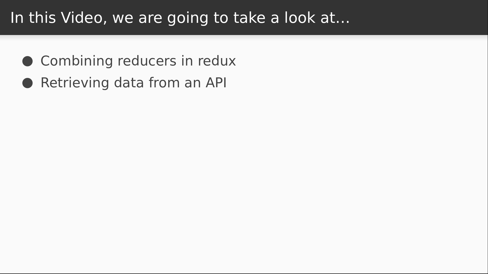

# Video 4.4

## Opening Slides


Hello and welcome to _List Pagination_. Our last two videos focused on using middleware to extend redux functionality and get more out of our actions. Today we'll be using redux to build a paginated list of API data.



First we'll learn how to combine multiple reducers in Redux so that our state management code will scale better. Then we'll write some new Redux code to retrieve a list of data from an API a component to execute it.

## Content

_open store.js_

First, a little housekeeping. I want to keep my pagination code separate from all the counter logic. I'll start by moving the reducer into its own file.

_cut, open ducks/counter.js, paste_

We still have an error in our reducer code, so let's fix that.

```javascript
  return { ...state, n: state.n + action.n };
```

And then we can export our reducer.

```javascript
export function reducer(state = initialState, action) {
  ...
}
```

Let's make one small change and use a constant instead of a hardcoded string for the action type.

```javascript
const INCREMENT = "counter/INCREMENT";

...

    case INCREMENT:
```

We're going to keep our actions in here as well too. We'll package them up in an `actions` object.

```javascript
export const actions = {
  increment: step => ({
    type: INCREMENT,
    n: step
  })
};
```

_open store.js_

Now we'll import our counter reducer as well as a function called `combineReducers` from Redux.

```javascript
import { createStore, applyMiddleware, combineReducers } from "redux";
import counter from "./ducks/counter";
```

The `combineReducers` function does just what it says: it allows us to combine multiple reducers into one store. We call it with a JavaScript object made up of our reducers.

```javascript
const reducer = combineReducers({ counter });
```

_open Counter.js_

Now a couple small changes to our component. We need to get our actions from the right place for starters.

```javascript
import { actions } from "./ducks/counter";
```

So we'll change our dispatch calls to pull the `increment` function off of the `actions` object.

```javascript
    inc: () => dispatch(actions.increment(props.step)),
    dec: () => dispatch(actions.increment(-props.step))
```

Then we have to deal with the state. Using combineReducers changed the shape of our state tree, so we'll need to update our selector to get its data from the right place. Previously `n` was a top level variable, but now it sits behind the `counter` key.

```javascript
  state => state.counter,
```

So if we modify our selector to return `state.counter`, we should be good to go.

_check browser_

And we're still operational, so let's get down to business.

_open terminal_

First we're going to write the code to consume the API, and we'll use the axios library for this.

```
$ yarn add axios
```

_open api.js_

Now in this `api.js` file let's import `axios` and supply some API defaults.

```javascript
import axios from "axios";

const api = axios.create({
  baseURL: "https://icanhazdadjoke.com",
  headers: {
    Accept: "application/json"
  }
});
```

We'll be connecting to an API that allows us to browser and search dad jokes. The `baseURL` indicates the root of the API, and we'll also use the `Accept` header to make sure we get results in the format that we want.

Next we'll define a function to search the API.

This accepts a search term, and some parameters to control the pagination. We'll default to an empty term,

and we'll begin on the first page and limit ourselves to ten dad jokes.

From here, we'll call the `.get` function against `forward-slash-search` and supply the query parameters.

This returns a promise which we'll use to extract the response data.

```javascript
export function search({ term = "", page = 1, limit = 10 }) {
  return api.get("/search", { params: { term, page, limit } });
}
```

The next step is to define an action creator that executes this search.

_open ducks/jokes.js_

Let's import our search API first.

Now we'll declare an action type that we'll dispatch when the data is received.

Next, our actions object will have a single `search` function accepting a term, a page number, and a limit to set the page size.

This is one of our asynchronous actions, so it returns a function that accepts the dispatch.

This executes our search API passing in the incoming parameters as members of a JavaScript object.

When we receive the response, we'll dispatch our `RECEIVED` action and put the response data in the `jokes` key of the data payload.

```javascript
import { search } from "../api";

const RECEIVED = "jokes/RECEIVED";

export const actions = {
  search: (term, page, limit) => dispatch =>
    search({ term, page, limit }).then(resp =>
      dispatch({ type: RECEIVED, jokes: resp.data })
    )
};
```

_open Jokes.js_

We're almost there. We just need a component that executes this action when it starts up. As usual, imports first. We'll be using the `connect` function to inject our `search` action into this component.

This will be a simple component class that will render nothing for the time being.

When the component mounts, we'll execute the search.

To connect this component, for now we can pass in `undefined` for the state because there's nothing there that we need.

As the second argument we'll just pass in the `actions` object, which will result in the `search` function being injected as a component prop.

```javascript
import React, { Component } from "react";
import { connect } from "react-redux";
import { actions } from "./ducks/jokes";

export class Jokes extends Component {
  componentDidMount() {
    this.props.search();
  }

  render() {
    return false;
  }
}

export default connect(undefined, actions)(Jokes);
```

_open Home.js_

Now we just need to import our new component and render it somewhere.

```javascript
import Jokes from "./Jokes";
      ...
      <Jokes />
```

_open browser_

Now take a look in the console and we can see that our RECEIVED action has been dispatched.

_expand action_

Here we see a bunch of pagination information and an array of jokes. So now that we know that our joke data is being fetched and dispatched properly, we can save it in a reducer and display it in a component. But we're out of time for today, so we'll have to finish that in our next lesson.


Join us for the next video, where we'll display and paginate our jokes list.
