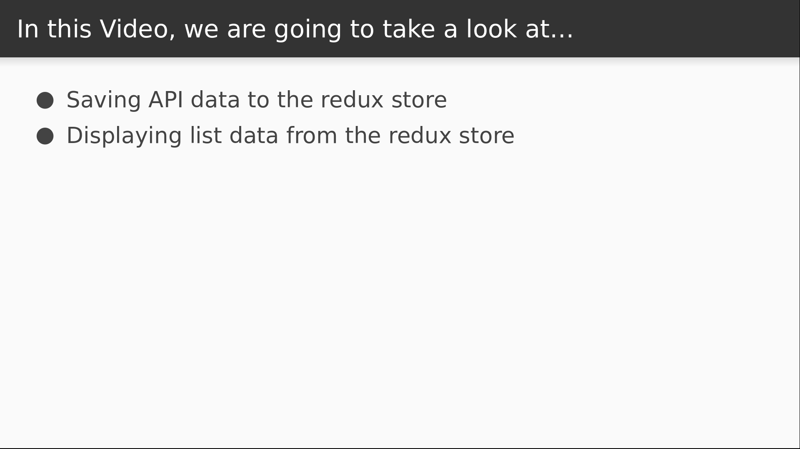

# Video 4.5

## Opening Slides


Hello and welcome to _List Pagination: Part II_. In our last video we wrote code to retrieve data from an API and dispatch it to the Redux store. In today's video we're going to save the data in our reducer and display it in a component.



We'll start by saving the data to a reducer. Then we'll add some code to display the results in a React component.

## Content

_open jokes.js_

Let's get started. First we'll declare some initial state for our jokes reducer.

We'll add more properties later, but for now we just want to keep track of the current page, the page size limit, and an array of results.

```javascript
const initialState = {
  page: 1,
  limit: 10,
  results: []
};
```

Next we need a function to update the state when jokes are received.

The action that we're dispatching puts the response data behind the `jokes` key of the action payload.

So we'll return a copy of the state, and then pull the `results` array off of the `jokes` object to populate our results variable.

```javascript
function received(state, action) {
  const { jokes } = action;

  return {
    ...state,
    results: jokes.results
  };
}
```

Next we write the reducer.

For now we are only listening for the `RECEIVED` action, in which case we use the function defined above.

Any unrecognized actions return the default state.

```javascript
export function reducer(state = initialState, action) {
  switch (action.type) {
    case RECEIVED:
      return received(state, action);
    default:
      return state;
  }
}
```

Now we need to add our reducer into our `combineReducers` statement.

```javascript
import { reducer as jokes } from "./ducks/jokes";
...
const reducer = combineReducers({ counter, jokes });
```

_open browser_

So now that our reducer is in place, let's take another look at our logging output.

_drill into state_

Notice that all of our data is saved to a reducer. So we have what we need to start populating our view layer.

_open Jokes.js_

For starters, let's inject our reducer state into the component.

```javascript
export default connect(state => state.jokes, actions)(Jokes);
```

Now let's define a couple of styled components for displaying our joke list.

We're going to have a two panel layout here, and our joke list will display on the left at full height with a light gray background.

```javascript
import styled from "styled-components";
...

const JokeList = styled.div`
  padding: 2rem;
  background-color: lightgray;
  width: 50%;
  height: 100vh;
`;
```

Our jokes will simple rectangles with the joke text vertically aligned in the middle with a bit of padding.

We'll give them a white background with a darkgray border, and we'll flip the colors a bit when the user hovers over a joke.

```javascript
const Joke = styled.div`
  display: flex;
  align-items: center;
  text-align: left;
  padding: 2rem 1rem;
  background-color: white;
  border: 1px solid darkgray;

  &:hover {
    background-color: forestgreen;
    color: white;
  }
`;
```

These styled components will make our render method nice and clean. We'll just pull the results off the props,

and then loop over them inside of a `JokeList` instance.

For each result, we'll render a `Joke` component, using the joke's id as the key and rendering the joke text as a child.

```javascript
  render() {
    const { results } = this.props;

    return (
      <JokeList>
        {results.map(j => (
          <Joke key={j.id}>
            {j.joke}
          </Joke>
        ))}
      </JokeList>
    );
  }
```

_open browser_

And there's our jokes! Now we need to add the ability to flip through the pages, but we're out of time for this lesson. Today we learned how to use Redux to get data from an API into our React components.


Join us for the next video, where we'll finally add pagination capability to our jokes list.
