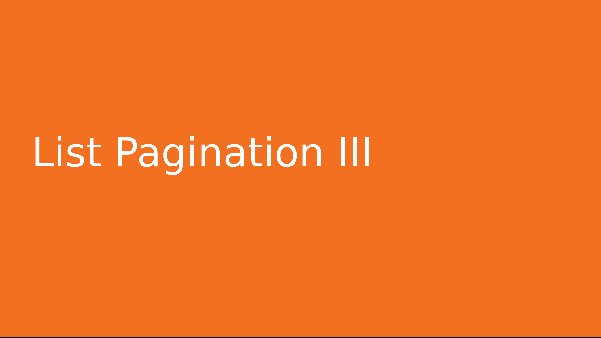
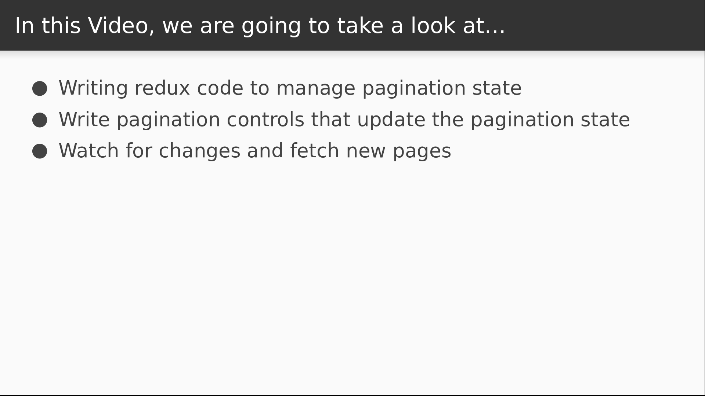

# Video 4.6

## Opening Slides



Hello and welcome to _List Pagination: Part III_. In our last video we wrote code to store API data in our Redux store and display it in a component. Today we're going to add pagination functionality to our list.



We'll start by adding reducer and action code that allows us to change which page of results we want to view. We'll then write components to display pagination controls, and add some logic to issue a new request whenever we request a different page.

## Content

_open ducks/jokes.js_

We're going to start in our reducer. We'll be keeping track of the total number of pages, so we need a state variable for that.

```javascript
  totalPages: 1,
```

Now let's define functions that will increment and decrement the current page.

The `nextPage` function will just increase the page number by one, but we can also make sure that it never goes above our `totalPages` variable.

Similarly, the `previousPage` function will decrease the page number by one, but can't go any lower than the first page.

```javascript
function nextPage(state) {
  return {
    ...state,
    page: Math.min(state.page + 1, state.totalPages)
  };
}

function previousPage(state) {
  return {
    ...state,
    page: Math.max(state.page - 1, 1)
  };
}
```

Now we need to wire these cases into our reducer function.

```javascript
const NEXT_PAGE = "jokes/NEXT_PAGE";
const PREVIOUS_PAGE = "jokes/PREVIOUS_PAGE";

...

    case NEXT_PAGE:
      return nextPage(state);
    case PREVIOUS_PAGE:
      return previousPage(state);
```

The next step is to add action creators for these new action types.

```javascript
  next: () => ({ type: NEXT_PAGE }),
  previous: () => ({ type: PREVIOUS_PAGE }),
```

Now we can start writing our pagination controls.

_open styles.js_

We'll be using a lot of buttons over the next few videos so let's define a styled-component that we can reuse first.

One feature we haven't seen yet is this attributes function that allows you to add properties to the DOM nodes that get rendered by `styled-components`. For our button, let's add a default type of "button", which is a good practice for preventing unwanted submissions.

Next, I want to be able to control the button's width dynamically, and I can actually do that by interpolating a function to resolve the css value.

These functions accept the props passed into the component as input, and they return some css value. So our `calculateWidth` function will look for a width property and use that to determine the width in percents. We'll default to 100.

Next we'll just add a few basic styles to make it look somewhat presentable and then add some styles for when the button becomes disabled.

```javascript
const calculateWidth = ({ width = 100 }) => `${width}%`;

export const Button = styled.button.attrs({
  type: ({ type = "button" }) => type
})`
  width: ${calculateWidth};
  background-color: forestgreen;
  color: white;
  border-radius: 0.25rem;
  padding: 0.5rem;
  font-size: 1.25rem;
  cursor: pointer;

  &:disabled {
    cursor: not-allowed;
    background-color: lightgray;
  }
`;
```

_open Filters.js_

Now to define our filter controls. Our component here is going to connect to the redux store and display some styled buttons that dispatch our new actions.

```javascript
import React from "react";
import { connect } from "react-redux";
import styled from "styled-components";
import { actions } from "./ducks/jokes";
import { Button } from "./styles";
```

This is going to go on the right side of our screen and take up half the width.

We'll add a bordered box with rounded corners around all of our controls.

Then we'll define a styled span for displaying the current page number.

```javascript
const Container = styled.div`
  width: 50%;
  padding: 2rem;
`;

const Content = styled.div`
  border: 1px solid lightgray;
  border-radius: 1rem;
  padding: 2rem;
`;

const PageInfo = styled.span`
  margin: 1rem;
`;
```

Our main component will accept some of the pagination data from our reducer as well as the `next` and `previous` action creators.

We then display our flipper buttons.

The button to view the previous page will be disabled if we're currently on the first page.

When clicked, it will execute the `previous` action.

Then we need a button that executes the `next` action, which is disabled if we're on the last page.

In the middle, we'll display which page we're on and how many pages there are in total.

Then we connect to the redux store, injecting the state from our `jokes` reducer as well as our action creators.

```javascript
export function Filters({ page, totalPages, next, previous }) {
  return (
    <Container>
      <Content>
        <Button width={10} disabled={page === 1} onClick={previous}>
          &lt;
        </Button>
        <PageInfo>Page {page} of {totalPages}</PageInfo>
        <Button width={10} disabled={page === totalPages} onClick={next}>
          &gt;
        </Button>
      </Content>
    </Container>
  );
}

export default connect(state => state.jokes, actions)(Filters);
```

We are really close to being done.

_open Jokes.js_

We'll be rendering our `Filters` component from here so we start by importing that.

```javascript
import Filters from "./Filters";
```

In order to achieve our two panel layout we'll use another wrapper component and style it as a flexbox row.

```javascript
const Content = styled.div`
  display: flex;
  flex-direction: row;
`;
```

Now we have some lifecycle changes to make. For starters, our `componentDidMount` should be using the `page` and `limit` information from the redux store as arguments to our `serach` function.

We then will add a hook for the `componentWillReceiveProps` lifecycle.

This is called whenever the props to a component change, and we can use it to detect if the user has requested to view a different page of data.

If the incoming `page` property doesn't match the current `page` property, we can issue another search request.

```javascript
  componentDidMount() {
    const { limit, page, search } = this.props;

    search("", page, limit);
  }

  componentWillReceiveProps(nextProps) {
    const { limit, page, search } = nextProps;

    if (page !== this.props.page) {
      search("", page, limit);
    }
  }
```

Then we will modify the render method to display our filters.

```javascript
  render() {
    const { results } = this.props;

    return (
      <Content>
        <JokeList>
          {results.map(j => (
            <Joke key={j.id}>
              {j.joke}
            </Joke>
          ))}
        </JokeList>
        <Filters />
      </Content>
    );
  }
```

_open browser_

Now we see our pagination controls to the right, and as I click the buttons you can see the list on the left updating with the new results. That's all the time we have for this lesson. Today we learned how to use redux to paginate data from an API.


Join us for the next video, where we'll add search capability to our jokes list.
