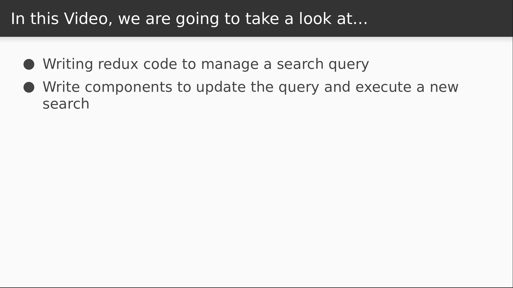

# Video 4.7

## Opening Slides


Hello and welcome to _Searching and Filtering_. In our last video we added pagination functionality to our list of Dad jokes. Today we'll add the ability to filter the list by a search term.



We'll start with the redux code that we need in order to manage the search query. Then we'll write the component to interface with the new redux code and tie it together by executing a new search whenever the search term is updated.

## Content

_open ducks/jokes.js_

Once again we'll start in our reducer so we can keep track of filters.

```javascript
  filters: { term: "" }
```

The API we're using only supports a `term` filter, but if it supported other filter parameters, we'd put those in here as well. Now let's define a function to update any given filter.

This returns a copy of the state with the filters updated.

Both the filter we want to update and the value that we want to use will be specified in the `action` object, so we update our existing filters with that information.

```javascript
function setFilter(state, action) {
  return {
    ...state,
    filters: {
      ...state.filters,
      [action.filter]: action.value
    }
  };
}
```

Then we declare a constant and add a case in our reducer.

```javascript
const SET_FILTER = "jokes/SET_FILTER";
...
    case SET_FILTER:
      return setFilter(state, action);

```

Then we need an action creator to trigger this mutation.

```javascript
  setFilter: (filter, value) => ({ type: SET_FILTER, filter, value }),
```

This will take the target filter and the desired value and pass them into the payload. The next thing we'll do is write a component that takes user input and sets it as the value of the `term` filter.

_open Search.js_

As we've seen before, we'll be connecting the component to the redux store so that it has access to the state and actions we need, and we'll also be using styled components to make it look presentable.

```javascript
import React, { Component } from "react";
import { connect } from "react-redux";
import styled, { css } from "styled-components";
import { actions } from "./ducks/jokes";
```

We're going to render a form with a text input and a submit button.

These are going to share some of the same styles, so we'll use the `css` function from styled components to declare a block of css to be reused.

Then we can declare a text input that uses these styles.

Then for our submit button, we're going to use a handy method that lets us add attributes to the native node.

In this case, we want to give it a type of `submit`.

Now we'll insert our `control` styles and add a background and a couple other styles.

```javascript
const Form = styled.form`
  padding: 1rem;
`;

const control = css`
  border-radius: .25rem;
  padding: .25rem;
  border-color: darkgray;
  width: 60%;
`;

const Input = styled.input`
  ${control}
`;

const Submit = styled.button.attrs({
  type: "submit"
})`
  ${control}
  background-color: forestgreen;
  margin-top: 1rem;
  color: white;
  cursor: pointer;
`;
```

Now we can define our search component. This is going to need some state management so we can track what the user is typing into the input.

We'll initialize the value based on the incoming props in case the term is already set.

Now a couple of event handlers. We'll declare an `onChange` function that will fire when we type into the input so we can update the `query` state.

Then we'll need a handler for when we submit our form.

This will prevent the default behavior, and then call the `setFilter` action, targeting the `term` filter and using our `query` state as the filter's value.

Now for the rendering.

We have our `Form` component at the top level that's hooked to our `submit` method.

Next we render the input using the value from our `query` state and our `onChange` event.

Now we can render our submit button.

The last step is to connect the component to the redux store to inject the state and actions that it needs.

```javascript
export class Search extends Component {
  state = {
    query: this.props.filters.term
  };

  onChange = e => this.setState({ query: e.target.value });

  submit = e => {
    e.preventDefault();
    this.props.setFilter("term", this.state.query);
  };

  render() {
    return (
      <Form onSubmit={this.submit}>
        <Input value={this.state.query} onChange={this.onChange} />
        <div>
          <Submit>Search</Submit>
        </div>
      </Form>
    );
  }
}

export default connect(state => state.jokes, actions)(Search);
```

_open Jokes.js_

We also need to make some updates here so that our component will execute a new search when the user submits a query. For starters, in `componentDidMount`, we should be getting the search term off of our reducer state instead of just assuming that it's blank when we first load this component.

Now let's update the `componentWillReceiveProps` method to see if the term has changed.

Now we're checking against the current page number as well as the search term to see if there have been any changes. If so, we execute the search.

```javascript
  componentDidMount() {
    const { limit, page, search, filters: { term } } = this.props;

    search(term, page, limit);
  }

  componentWillReceiveProps(nextProps) {
    const { limit, page, search, filters: { term } } = nextProps;

    if (page !== this.props.page || term !== this.props.filters.term) {
      search(term, page, limit);
    }
  }
```

_open Filters.js_

The last step is to import and render our `Search` component inside of the `Filters` component.


```javascript
import Search from "./Search";
        <Search />
```

_check browser_

Now if I enter a search term into the input and submit it, on the left we see the list updating with the filtered results. That's all the time we have for this lesson. Today we learned how to use Redux to filter the data from our API.


Join us for our next section, where we'll focus on getting by in React without the help of Redux and Flux.
