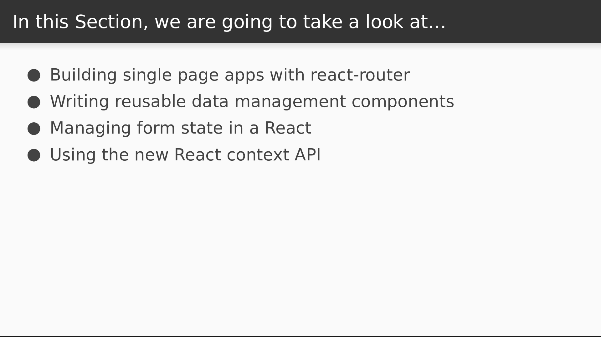
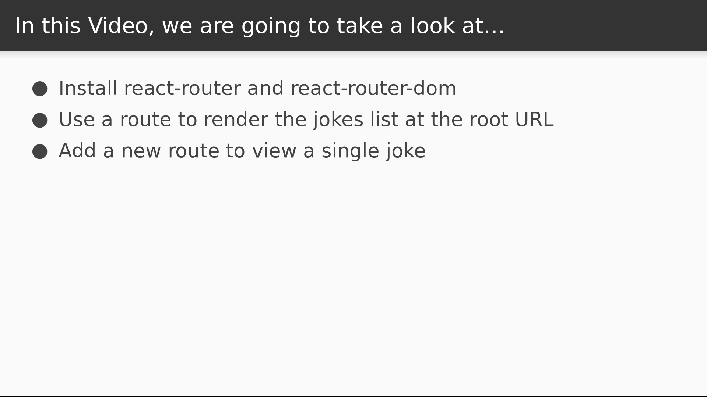

# Video 5.1

## Opening Slides


Hello and welcome to _React Without Redux_. In this section we'll learn how to get by in React without leaning on Redux.



We'll be learning how to use react-router to support multiple pages in the application that map to a URL. Then we'll be writing some generic React components for general purpose data management. We'll then take a look at managing form data using the final-form library, and finally have a peek at the new React context API.


In today's video we'll be setting up additional pages in our React application using react-router.



We'll start by installing react-router and setting it up so that the root URL displays the jokes list. We'll then add a new route that will allow us to view a single joke.

## Content

_open terminal_

In Redux, we often represent the entire state of our application in the Redux store, but routing is one thing that we don't usually rely on Redux for. When it comes to mapping a URL to a screen in a React application, the best known solution is probably `react-router`.
Let's install this as well as `react-router-dom`.

```
$ yarn install react-router react-router-dom
```

_open Home.js_

Let's wire this into our app. First we need to import a couple things from `react-router-dom`.

```javascript
import { BrowserRouter as Router, Route } from "react-router-dom";
```

Now instead of rendering our `Jokes` component directly, we'll render our `BrowserRouter`, and inside that we'll have a single route that maps the root URL to our `Jokes` component.

```javascript
    <Router>
      <Route exact path="/" component={Jokes} />
    </Router>
```

From a user perspective the app should still look the same.

_open browser_

I'm currently at the root URL and it's displaying my `Jokes` component, so we're looking good so far. The next think we want to do is turn each joke in this list into a link that will open a new page displaying the joke.

_open Jokes.js_

We'll use the `Link` component from `react-router-dom` in order to link to another page.

```javascript
import { Link } from "react-router-dom";
```

Next let's style this link just a little bit. For starters let's make a `JokeLink` component that trasforms an `id` into a URL and renders a `Link`.

```javascript
const JokeLink = ({ id, ...props }) => <Link to={`/jokes/${id}`} {...props} />;
```

Next, instead of a styled div, our `Joke` component can apply styles to the `JokeLink` component instead.

```javascript
const Joke = styled(JokeLink)`
  ...
`
```

This is a feature of `styled-components` that we haven't seen yet, but here's the gist: in addition to native nodes, you can also pass a React component to the `styled` function, and as long as that component takes a `className` or `style` property, the `styled-components` library can enhance it. We just need to make a couple changes to our style declarations.

```javascript
  text-decoration: none;
  color: black;
```

This is to prevent the link showing up in blue, underlined text as it otherwise would by default. Now we just need to pass the joke id into our `Joke` component so it can generate the correct URL path.

```javascript
            <Joke key={j.id} id={j.id}>
```

```javascript
import { Router, Route } from "react-router-dom";
```

Just a couple more quick changes and we'll be ready.

_open Joke.js_

First we need to write the component that will be displayed when we navigate to a joke page.

This component will be rendered by `react-router`, which will inject a `match` property into it.

The `match` object contains lots of useful info, including any parameters that were used in the URL path. In this case, we have an `id` param denoting the joke ID, which we'll display in an `h1` tag.

```javascript
import React from "react";

export default function Joke({ match }) {
  return <h1>{match.params.id}</h1>;
}
```

_open Home.js_

So the last step is to add a route to our new component. We'll import the `Joke` component first.

```javascript
import Joke from "./Joke";
```

Then we'll add the route. Our `Router` component only accepts a single node as children, so we'll wrap our routes in a fragment.

Then we'll render a new route to our Joke component where the URL identifies a joke by ID.

```javascript
      <React.Fragment>
        <Route exact path="/" component={Jokes} />
        <Route exact path="/jokes/:id" component={Joke} />
      </React.Fragment>
```

_check browser_

Now when I click on a joke we transition to a different page that displays the joke id in an `h1` tag.

_open Home.js_

As you can see, with react-router it's very easy to handle the problem of routing without involving Redux at all. However, you might still want to report these navigation events. So before we close out, we can demonstrate how easy it is to do that. We'll do this by using a different router component that gives us control over the history.


```javascript
import { Router, Route } from "react-router-dom";
import createHistory from "history/createBrowserHistory";
```

We can use the `createHistory` function to create a browser history object.

Then we can use the `listen` function to execute a callback every time our router executes a change of location.

For now we'll just log the navigation information to the console.

```javascript
const history = createHistory();

history.listen((location, action) => {
  console.log(location, action);
});
```

Then we have to pass this object into our router.

```javascript
    <Router history={history}>
```

_open browser_

Now as we navigate we see the navigation info being logged to the console.

_open Home.js_

So you could really do a number of things from here. You could capture the navigation event and send it to Google Analytics. Or you could dispatch it to your redux store so that your redux history includes your navigation history.

_[open react-router-redux](https://github.com/reacttraining/react-router/tree/master/packages/react-router-redux)_

Alternatively, if you want complete redux integration with react-router, you can try the `react-router-redux` library, which fully synchronizes the history with the redux store. This allows you to dispatch redux actions that result in a route change.


That's all the time we have for this lesson. Join us for the next video where we'll see how to manage data without using Redux.
