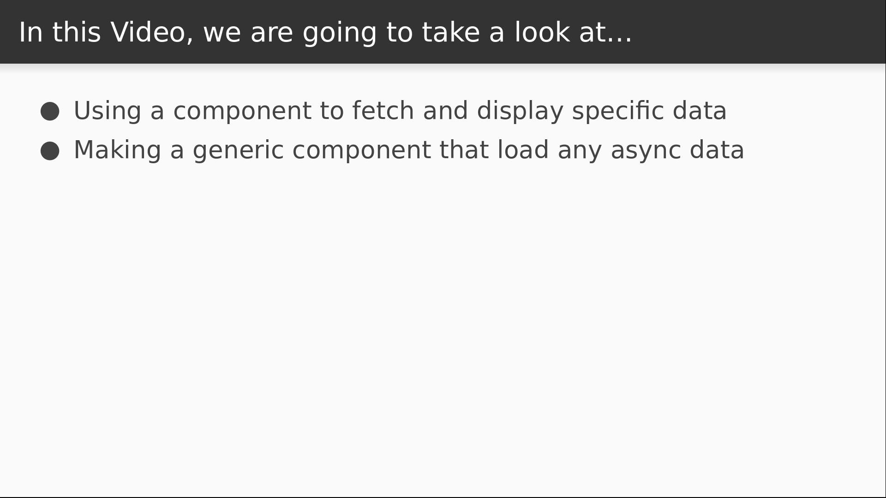

# Video 5.2

## Opening Slides


Hello and welcome to _DRY Data Management Containers_. In our last video we integrated react-router into our application in order to support mapping different URLs to different pages. Today we'll see how to make reusable state management utilities using only React.



We'll begin by using a React component to fetch data asynchronously, store it, and display it. Then we'll pull it out into a higher order component so we can easily reuse it.

## Content

_open api.js_

For starters, let's add another API function for fetching a single joke by its identifier.

```javascript
export function fetch(id) {
  return api.get(`/j/${id}`);
}
```

_open Joke.js_

Next we're going to change our `Joke` function into a component class so that we can access the lifecycle.

We'll keep a state variable for the joke text.

Then when the component mounts, we call fetch with the `id` param that react-router pulled from the URL.

When the call returns we'll set the joke text in our component state.

In our render function, we won't display anything if there's no joke data. Once we retrieve it and re-render, we'll display the joke in an `h1` tag.

```javascript
import React, { Component } from "react";
import { fetch } from "./api";

export default class Joke extends Component {
  state = {
    joke: null
  };

  async componentDidMount() {
    const { data: { joke } } = await fetch(this.props.match.params.id);
    this.setState({ joke })
  }

  render() {
    const { joke } = this.state;

    if (!joke) {
      return false;
    }

    return <h1>{joke}</h1>;
  }
}
```

_open browser_

Now when we view our joke page, it's fetching and displaying the joke text, so we've accomplished our first goal.

_open Joke.js_

Our next goal is to change this into something reusable. In any realistic application we'd be dealing with more than just one resource type, so there are lots of different things that we'd wind up fetching from an API. I want to define a higher order component that takes care of this, and to guide the design I'm first going to decide what the interface will look like.

The higher order component function will be called `dataLoader`, and the first argument will be a property name, in this case "joke". What we're saying here is that when we're finished retrieving the data, we want it to get passed into our component as the `joke` property.

The next argument will be an asynchronous function for retrieving the data. This function accepts the component props as an argument.

Once again, we'll be using the `match` prop so that we can pass our `id` param into the `fetch` function to retrieve our joke.

When the joke is retrieved, we'll return the `joke` text because it's all we care about.

```javascript
export default dataLoader("joke", ({ match }) =>
  fetch(match.params.id).then(resp => resp.data.joke)
)(Joke);
```

_open dataLoader.js_

So let's write this thing. We know that we have a `dataLoader` function that accepts a `propName` argument and a function for loading the data.

Then as usual, we return a function that accepts a React component as input and returns another React component as output.

Our component class will keep a state variable for the current data and another one to keep track of the data's initial value.

Next we'll define an `async` function called `reload`.

This will get the data from the `loader` function that was passed in.

Then we set the data as both the current and initial state.

We'll execute our `reload` function when the component mounts.

```javascript
import React from "react";

export default function dataLoader(propName, loader) {
  return Component =>
    class extends React.Component {
      state = {
        data: null,
        initial: null
      };

      reload = async () => {
        const data = await loader(this.props);
        this.setState({ data, initial: data });
      };

      componentDidMount() {
        this.reload();
      }
    };
}
```

Now for our render function. Just as we did in the `Joke` component before, we'll display nothing if the `data` hasn't been set yet.

If we do have the `data`, we'll assemble the component props that we want to pass. These will include whatever props were passed from the parent, as well as our `data` state which gets set behind the key designated by the `propName` argument. This is how we go about making sure that our `Joke` component's text will be passed as the `joke` property.

As soon as those are assembled, we can render the component that we're extending and pass in the props. We'll also pass in our function for reloading the data.

```javascript
      render() {
        const { data } = this.state;

        if (!data) {
          return false;
        }

        const props = { ...this.props, [propName]: data };

        return <Component {...props} reload={this.reload} />;
      }
```

Now let's go fix up our `Joke` component.

_open Joke.js_

We already have our higher order component function applied how we want it. We just need to actually import it and then we can change our component back into a pure function.

```javascript
import dataLoader from "./dataLoader";

export function Joke({ joke }) {
  return (
    <h1>{joke}</h1>
  );
}
```

_open browser_

Back in our browser we can see that the component still works as it did before, which means we now have a workable solution for reusable loading and displaying of data. The next goal is to add state management capabilities, but we're out of time for this lesson.


Join us for our next video where we'll add state updates to our new data management component.
