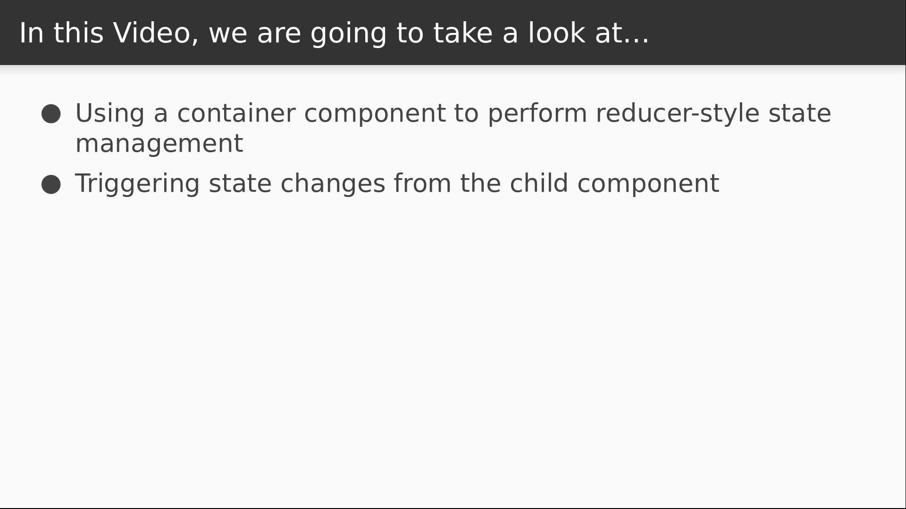

# Video 5.2

## Opening Slides


Hello and welcome to _DRY Data Management Containers II_. In our last video we made a higher order component for easily fetching data asynchronously and displaying it in a component. Today we'll extend our container with state management capabilities.



We're going to approach this problem very similar to how we would write a reducer, but everything will take place inside components. First we'll declare what sorts of state mutations are possible, then we'll define a way to execute those mutations so they can be performed from our component.

## Content

_open styles.js_

Before we dive in too deep, let's do a little styled-components work just to keep our view looking somewhat presentable. First will be an outermost flex column with items center aligned.

Now here's a handy feature we haven't seen yet. Any styled-component has an `extend` function on it.

This allows you to define a new component with the same base styles and add new styles to it. So our content region has the same rules as the container but it's limited to 70% width.

```javascript
export const Container = styled.div`
  display: flex;
  flex-direction: column;
  align-items: center;
`;

export const Content = Container.extend`
  width: 70%;
`;
```

_open Joke.js_

Now let's use the new components to update our presentation. Rather than a simple heading, we'll render it inside the content and container components we made, and add an input as a sibling which will display the joke text.

```javascript
import { Container, Content, Input } from "./styles";

export function Joke({ joke }) {
  return (
    <Container>
      <Content>
        <h1>{joke}</h1>
        <Input width={70} value={joke} />
      </Content>
    </Container>
  );
}
```

Next we want to be able to type into this input and have it change the value of our joke. I'm going to approach this similar to a reducer and map action types to state mutatios, but I'll do it in an object literal that gets passed into the data loader.

We're just going to have one mutation right now, called `UPDATE_JOKE`.

A mutation will be a higher order function that accepts the current state of our data loader component.

This returns a function that accepts whatever args you need to support your mutation. Our function will be taking text from the input and returning the text exactly as it is, because that's what we want the resulting state to be.

```javascript
export default dataLoader(
  "joke",
  ({ match }) => fetch(match.params.id).then(resp => resp.data.joke),
  {
    UPDATE_JOKE: state => text => text
  }
)(Joke);
```

_open dataLoader.js_

So now we need to figure out how to implement these mutations. For starters we need to add a `mutators` argument to our `dataLoader`, which will default to an empty object.

```javascript
export default function dataLoader(propName, loader, mutators = {}) {
}
```

Next we'll define a component function that triggers a mutation. We'll call it `send`, much like we did when we created our data store view bindings in the third section.

Once again this will be a higher order function. It accepts the name of a mutator and it returns a sort of function proxy, where we accept the args that we'll eventually pass into the mutation function.

So we'll use the mutator name to see if the mutation function is registered in our `mutators` object.

If it's not, then we can call `setState` with `null`, which results in making no updates to the state.

Otherwise, we invoke our mutator function with the state and the supplied arguments and set the return value into our container state.

```javascript
      send = mutator => (...args) => {
        const f = mutators[mutator];

        if (!f) {
          this.setState(null);
        } else {
          this.setState({ data: f(this.state.data)(...args) });
        }
      };
```

Now we can pass this into the decorated component.

```javascript
            send={this.send}
```

_open Joke.js_

That means that we can add the `send` function to our component signature and invoke it during the `onChange` event of our input.

```javascript
export function Joke({ joke, send }) {
  return (
    <Container>
      <Content>
        <h1>{joke}</h1>
        <Input
          width={70}
          value={joke}
          onChange={e => send("UPDATE_JOKE")(e.target.value)}
        />
      </Content>
    </Container>
  );
}
```

_open browser_

Now in our browser we observe that the joke text is displayed in the input, and when I type into it, it updates both the input and the heading. There's a couple more things we can do with this before we're finished, so let's add some stuff.

_open dataLoader.js_

For starters, it would be nice to be able to reset to the initial state if I don't like my changes. That's really easy since we're keeping track of it already.

```javascript
      revert = () => this.setState(state => ({ data: state.initial }));
```

Now we pass this `revert` function into the component.

```javascript
            revert={this.revert}
```

_open Joke.js_

We'll import styled-components to display a button row.

Then we add `revert` to the function signature and add a button that executes it.

```javascript
import { Container, Content, Input, Button, Row } from "./styles";

export function Joke({ joke, send, revert }) {
  ...
        <Row width={70}>
          <Button onClick={revert}>Revert</Button>
        </Row>
  ...
}
```

_open browser_

Now after making changes to the input, I click the revert button and it goes back to how it was.

_open api.js_

Let's do one more thing just for fun. The API we're using has an endpoint to fetch a random joke.

```javascript
export function random() {
  return api.get("/");
}
```

Let's use this one in our component instead just to demonstrate something else.

_open Joke.js_

So even though this is supposed to be a page to view a specific joke, let's fetch a random one instead.

```javascript
import { fetch, random } from "./api";

...

export default dataLoader("joke", () => random().then(resp => resp.data.joke), {
  UPDATE_JOKE: state => text => text
})(Joke);
```

Now do you remember in our last video that we added a `reload` function to our container in the beginning? Let's use it.

We'll add it to our signature and add a second button that will call it when clicked.

Then we'll adjust the button widths a bit.

```javascript
export function Joke({ joke, send, revert, reload }) {
  ...
          <Button width={45} onClick={revert}>Revert</Button>
          <Button width={45} onClick={reload}>Shuffle</Button>
  ...
}
```

_open browser_

Now when I click the shuffle button, I can flip through these jokes at random.

If I modify the joke and revert, it'll go back to the most recently fetched joke.

That's all the time we have for this lesson. Today we learned a way to add reusable state management capabilities to our data management components in a way that mimics some parts of the external data store designs we've seen.


Join us for our next video where we'll write more reusable container code to handle additional concerns.
