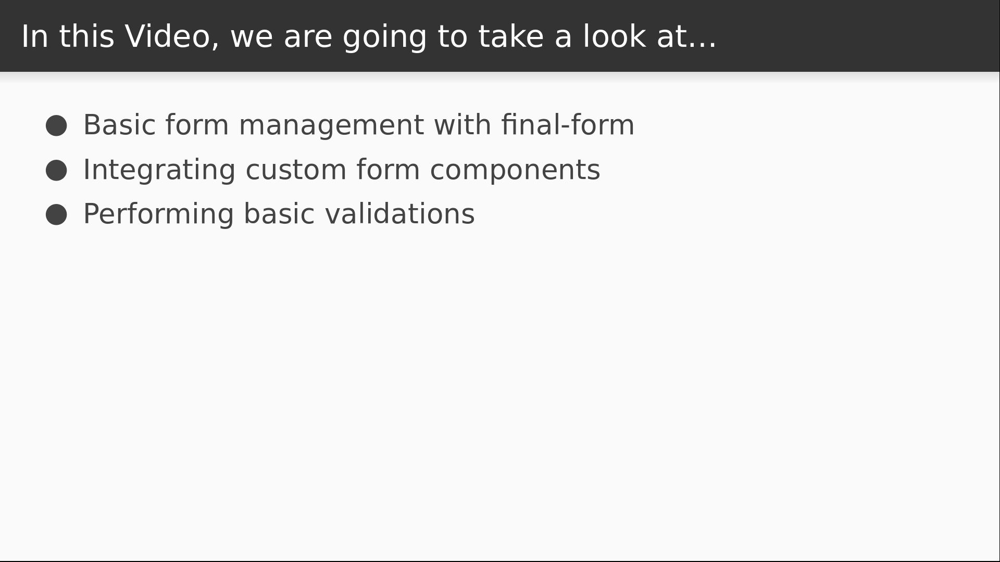

# Video 5.4

## Opening Slides


Hello and welcome to _Form Management in React_. In our last two videos we saw a way to write some reusable state management code without the help of an external data store. Today we'll use the final-form library as a way to manage form state in React.



We'll start by setting up the final-form library to display a simple form. Then we'll hook up validation logic and add some more inputs to demonstrate the capabilities of our setup.

## Content

_open [redux-form docs](https://redux-form.com/7.2.3/)_

If you are building a redux application and you have to do forms, there's a high likelihood that your internet search will lead you to this page. ReduxForm is a very popular and fully featured library that manages the state of your forms in the redux store. But although it works well, there are good reasons not to do this. As an example, the design dispatches a redux action every time there's a keystroke in a form input, or any other change to a form field. These tiny events aren't meaningful in the execution history of our application, so capturing them isn't really what redux actions are designed for. There are also potential performance implications to making so many updates to the store.

_open [author's blog post on the subject](https://codeburst.io/final-form-the-road-to-the-checkered-flag-cd9b75c25fe)_

For more details you might want to read this post that the author of redux-form wrote about the various problems with the library. It's a good read and a good introduction to a new library that he wrote in response to these issues. The library is called final-form and it's what we'll be using for this video.

_open terminal_

Final-form has no dependencies and works without React, so in addition to this library we'll also want to install his react-final-form library.

```
$ yarn add final-form react-final-forms
```

Now we can start building our form.

_open SignUp.js_

Today we'll build a simple sign-up form on top of some of our styled-components and two from react-final-form.

The sign-up component will display its contents inside our container and content components.

We'll add a heading, and then render the form container.

This needs an `onSubmit` prop, which would normally be a function that takes the structured form data and submits it to a server. For now we'll just print it to the console.

Next we can use the `render` property to display the contents of our form. The render function will accept several arguments, but for now we just care about the `handleSubmit` argument, which is a final-form wrapper around our `onSubmit` function above.

Our function will return our styled form component, which will call the `handleSubmit` function on the actual form submission event.

Inside our form we display the Field component from react-final-form.

The first property is the name of our field. This is going to be an email address input named `email`.

The `component` prop tells `react-final-form` how to render the field. If we pass in a string with the value of `input`, it will render a plain text field.

From here we can add additional props that would be accepted by the rendered component. For example, an html input can accept some placeholder text.

```javascript
import React from "react";
import { Form as FinalForm, Field } from "react-final-form";
import { Container, Content, Form } from "./styles";

export default function SingUp() {
  return (
    <Container>
      <Content>
        <h1>Sign Up</h1>
        <FinalForm
          onSubmit={data => console.log(data)}
          render={({ handleSubmit }) => (
            <Form onSubmit={handleSubmit}>
              <Field
                name="email"
                component="input"
                placeholder="Email Address"
              />
            </Form>
          )}
        />
      </Content>
    </Container>
  );
}
```

Our form is complete, so we just need to wire it up to our router and give it a test drive.

_open Home.js_

We'll just import the component here and assign it a route.

```javascript
import SignUp from "./SignUp";
  ...
        <Route exact path="/signup" component={SignUp} />
```

_open browser, navigate to /signup_

Now if I type some text into the input and hit enter, it causes a submission event which displays the form data to the console. Notice how it's structured into a javascript object mapping field names to values. This is really handy, and if you design your form to have this object formatted the way your server already expects, then you can hand it right off without doing any processing on it. You can make these structures as deep as you want, too.

_open SingUp.js_

For example, let's rename our field to `user.email` and see how that changes things.

```javascript
                name="user.email"
```

_open browser, type in input, hit enter_

Now we see that or form data is structured differently. This time we have a top level user object that contains the email data.

_open SignUp.js_

We've barely scratched the surface here though, so let's see a couple more examples of what we can do with this library. For starters, we'd rather use our styled `Input` component instead of what we have now. This is pretty easy.

Let's import it first, and then make a final-form wrapper around it.

When you pass a custom component to the `Field`, it will render your component and pass in a couple props. For now we just care about the `input` prop.

This contains the `value`, the `onChange` handler, and other native HTML props, so we can safely destructure the whole object into our styled input.

```javascript
import { Container, Content, Form, Input } from "./styles";

function FormInput({ input }) {
  return <Input {...input} />;
}
```

We'll also want to propagate our placeholder text.

```javascript
function FormInput({ input, placeholder = '' }) {
  return <Input {...input} placeholder={placeholder} />;
}
```

Then we use this instead of the "input" string literal.

```javascript
                component={FormInput}
```

_open browser_

Now our form works the same way but using our styled input so we can stay consistent with the look of our site. And now that we're using our own component, we can start talking about other things like validation.

_open styles.js_

First, let's style our input differently when there's an error flag.

```javascript
  border-color: ${props => (props.error ? "red" : "darkgray")};
```  

This is an easy way to get some feedback. Now let's add the validation code.

_open SignUp.js_

Final-form allows you to plug in a custom validation function that takes the form values as the first argument. It accepts other arguments which we don't need to worry about for our usage.

To validate, we need to drill into the user's email.

The user might be undefined so we'll set a default.

If there's no email set, we want a validation error. The only rule is that we return a structure that matches the form values. That means it has a top level user object with an email property.

We can use a string as the error message, or an array of strings if we want to support multiple errors.

If we have no errors we return an empty object.

```javascript
function validate(values) {
  const { user = {} } = values;

  if (!user.email) {
    return { user: { email: ["Required Field"] } };
  }

  return {};
}
```

Next we will use another argument that `final-form` supplies to our custom components.

The `meta` object contains information about the field like whether it's been changed or has errors.

We'll use that to derive the value of our `error` flag so that our styled component will have a red border when invalid.

```javascript
function FormInput({ input, meta }) {
  const hasError = meta.touched && meta.error;

  return <Input {...input} error={hasError} />;
}
```

All that remains is to pass this into the form wrapper and test it.

```javascript
          validate={validate}
```

_open browser_

Now notice that I can't submit my form when the input's empty. Hitting the enter key makes the input show red and we don't see anything output to the console. After typing some data in, I can submit the form again. We can improve a lot on this setup, but we're out of time for today.


Join us for our next video where we'll dive deeper into form validation and complete our signup form.
