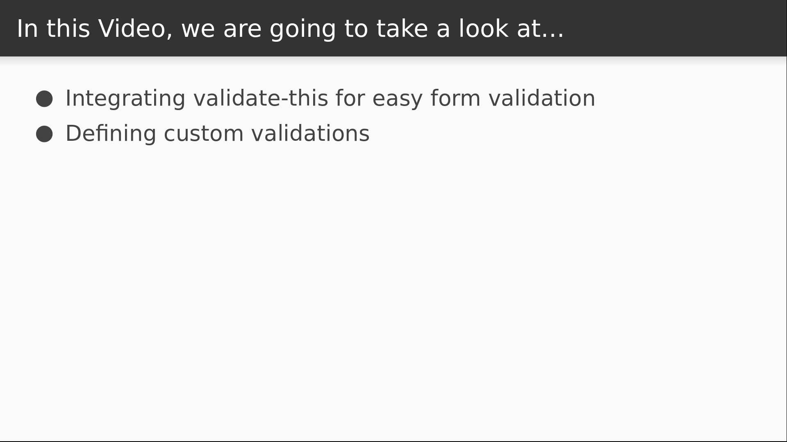

# Video 5.5

## Opening Slides


Hello and welcome to _React Form Validation_. In our last video we integrated the final-form library into our application to handle form state management independently of redux. Today we'll be building onto the validation functionality that we started in the last video.



We'll start by adding a library to perform easier validations. Then we'll add some more fields and validations to our form.

## Content

_open SignUp.js_

Let's take a look at the validation function we wrote in the last video. It doesn't seem so bad now, but if we started to add a lot more fields it could get ugly really fast.

_open validate-this on npm_

I wrote my own library called `validate-this` to remove some of the pain from this process. Like final-form, it has no dependencies of its own and can be used in any JavaScript application to validate any JavaScript object. Let's take it for a spin.

_open terminal_

First step is installation.

```
$ yarn add validate-this
```

_open SignUp.js_

The package exposes a `validator` function which we need to import.

What we'll return now from our `validate` function is the result of calling `validator` on our `values`. The second argument is a function that takes an object that we use to perform the actual validation checks.

Our form data has a top level user object which we need to drill into in order to validate the email. We do this with the `validateChild` function.

We specify the name of the child object to drill into, in this case our `user` object. The second argument is a function that lets us perform validations on the `user`.

Here's where we use the `validate` function and we pass in all the field names that we want to run a validation on. In this case we only have our email field to validate.

Now we can use one of the library's built in validations which will return an error if the field has no value.

```javascript
import { validator } from "validate-this";

function validate(values) {
  return validator(values, form => {
    form.validateChild("user", user => {
      user.validate("email").required();
    });
  });
}
```

_check browser_

Now if we test our app we see that it works like it did before, except the error message that we're displaying has changed to to the one that was returned by the library. If we want to change it back to our own text, we'll need to use custom validations.

_open SignUp.js_

To do that we'll define a function called required that accepts a single value.

If that value is falsy, we'll return our error text.

```javascript
const required = val => {
  if (!val) {
    return "Required Field";
  }
};
```

Now instead of the built in validation, we'll call the `satisfies` function and pass in our custom validation function.

```JavaScript
      user.validate("email").satisfies(required);
```

_open browser_

Now we have our custom error message back. If we type some text into the input, it goes away. And actually that's sort of a problem because this isn't a valid email address. Let's fix that too.

_open terminal_

The path of least resistance here is with a small library that can validate email addresses.

```
$ yarn add email-validator
```

_open SignUp.js_

In this case we import the default.

```javascript
import email from "email-validator";
```

Now we'll use it to build another custom validation function called `validEmail`.

This will return an error if the value is present but fails the library's validation test.

```javascript
const validEmail = val => {
  if (val && !email.validate(val)) {
    return "Not a Valid Email Address";
  }
};
```

Now we can add this function as an additional argument to `satisfies`.

```javascript
      user.validate("email").satisfies(required, validEmail);
```

_open browser_

Now if it's blank we still see our `Required Field` message, but if the field contains an actual value that's not a valid email address, we see the new error.

_open SignUp.js_

Now let's add some more fields to this form. We need a password and a password confirmation.

These will look like our `email` field with some property values changed, but we'll also be adding a `type` property to mask the input.

```JavaScript
              <Field
                name="user.password"
                component={FormInput}
                placeholder="Password"
                type="password"
              />
              <Field
                name="user.confirm"
                component={FormInput}
                placeholder="Confirm Password"
                type="password"
              />
```

Of course we need to modify our custom component to account for this new property.

So we can add it to the component signature, give it a default value, and pass it into our styled input.

We also want to add a little space between the inputs, and styled-components will allow you to pass an inline style as another way to extend or override existing styles.

```JavaScript
function FormInput({ input, meta, type = "text" }) {
  ...
      <Input
        {...input}
        type={type}
        error={hasError}
        style={{ marginBottom: "1rem" }}
      />
  ...
}
```

Next up is validations. Both of these fields are required and should also match. We can take care of that first requirement by passing both fieldnames into the `validate` function and then using `satisfies` with our custom `required` validation.

```javascript
      user.validate("password", "confirm").satisfies(required);
```

Now let's write another custom validation to make sure they match.

Once again, higher order functions come to the rescue. The argument for the outer function is the fieldname that we want to match against.

Then we return our validation function. So far, these functions have taken the field value is input, but as a second argument, `validate-this` also supplies all the values of the current validation scope. So in this case, the `values` object contains all of the user fields.

What we can do then is check if our value is equal to the field by indexing the `values` object with the `fieldname` argument.

If they don't match, we return our error.

```JavaScript
const matches = fieldname => (val, values) => {
  if (val !== values[fieldname]) {
    return `Does not match ${fieldname}`;
  }
};
```

Now we run this validation against our `confirm` field.

The validation rule that we pass to `satisfies` is derived by calling our `matches` function with the name of our password field as an argument.

```JavaScript
      user.validate("confirm").satisfies(matches("password"));
```

_open browser_

Now my password fields show the `Required Field` message when they're empty.

As soon as I type a value in the password field, I see that the confirmation shows two error message because it's failing both validations.

Now as I type in the confirmation field, our matching validation error will remain until I match up the passwords.

That's all the time we have for this lesson. Today we learned how to use the `validate-this` library to painlessly perform custom validations against the structured form data that's used in `final-form`.


Join us for our final video, where we'll preview the very near term future of state management in React with a look at the new context API.
